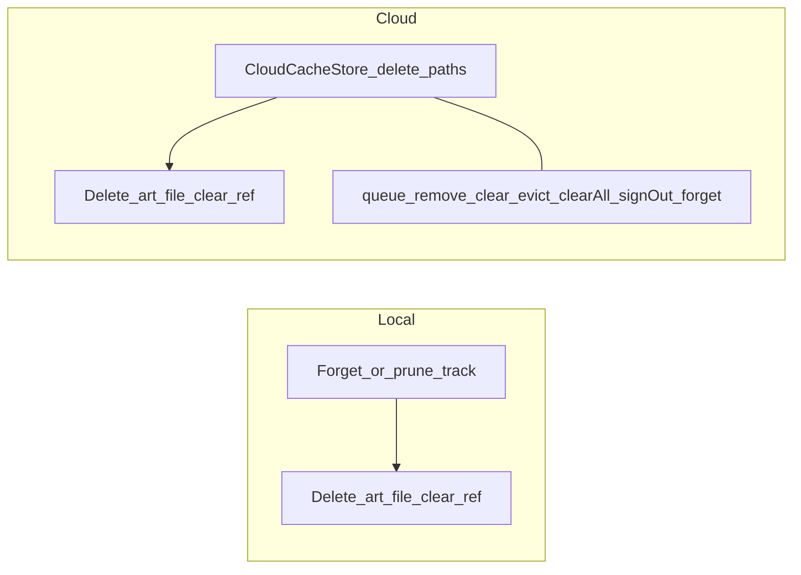

# Album covers — decision report

## Goal

Show embedded cover art on **queue rows** and **system media UI** (notification / lock screen via `audio_service` `MediaItem`), without a parallel cache architecture.

## Locked decisions

### Surfaces
- **In-app:** queue list only (not a full-bleed now-playing hero in v1).
- **System:** larger art via `MediaItem.artUri` when a file exists.

### When to extract
| Source | Timing |
| --- | --- |
| **Local** | At ingest / re-scan, with existing tag read (`TrackMetadataReader`). |
| **Cloud** | Lazy on the **same play-path** that already downloads/cache-hits and enriches tags in [`playback_uri_resolver.dart`](lib/features/player/application/playback_uri_resolver.dart). No download solely for art. |

### Storage
- **One file per track** under app cache, e.g. `artwork/<trackId>.jpg`.
- Absolute/relative path stored in existing Drift column `tracks.artworkCacheRef` ([`tables.dart`](lib/core/database/tables.dart)) — column already exists and is unused today.
- Art does **not** count toward the cloud GB budget slider (only shares delete triggers).

### Decode / write
- Cap decode to ~**512px** longest edge, encode **JPEG**.
- Do not keep original embedded bytes on disk.

### Missing / failure
- Quiet miss: leave `artworkCacheRef` null; omit `MediaItem.artUri`.
- **No** generic placeholder icon or app logo stand-in.
- **No** “no art” sentinel — null means “no file”; retry when enrichment runs again and still null is acceptable YAGNI (overwrite path below covers successful extracts).

### Queue UI layout
- Cover sits in the **trailing** cluster: **immediately left of** the remove-from-queue button (not a leading thumb).
- Slightly reduce right list padding for horizontal room.
- No art → no thumb widget; title/artist **expand toward** the delete button (collapse; no reserved empty slot).
- Current anchor: [`playlist_home_screen.dart`](lib/features/playlist/presentation/playlist_home_screen.dart) `ListTile` trailing `IconButton`.

### Overwrite policy
- When extract yields cover bytes (ingest, re-scan, or cloud play-path enrichment): **always rewrite** the art file and update `artworkCacheRef`.
- When extract yields no bytes: leave prior file/ref as-is (do not invent a clear-on-missing policy in v1).

### Cleanup (no parallel architecture)
Align with existing catalog / cloud-cache rules:

- **Local:** delete art when the track row goes away (Forget / prune). No separate “clear local art” action.
- **Cloud:** hook the same places that already delete audio cache ([`CloudCacheStore`](lib/core/cloud/cloud_cache_store.dart): `deleteForTrack` / `deleteForRoot` / `clearAll` / budget eviction). Catalog Forget already removes tracks → art goes with row cleanup.
- Intentional trade-off: after clear cache / sign-out / eviction, thumbnails are gone until the next play re-extracts (same “gone until play” model as audio).

## Out of scope (v1)
- Deduplicating identical album art across tracks.
- Online cover fetch / MusicBrainz / etc. — **candidate later:** see [`docs/features/online-cover-fetch.md`](../../docs/features/online-cover-fetch.md) (opt-in, play-path only when art null; privacy gate required).
- Counting artwork toward cloud cache budget.
- Dedicated now-playing full-screen art surface.
- Persisting a “confirmed no art” flag.

## Implementation sketch (after you approve build)

1. **Artwork store helper** — write capped JPEG, path convention, delete-by-trackId; call from ingest + play-path enrichment + cache/Forget hooks.
2. **Ingest / resolver** — stop discarding `artworkBytes`; write file + set `artworkCacheRef` (local ingest; cloud in existing tag enrichment after local file available).
3. **MediaItem** — when publishing metadata, set `artUri` from file path if ref non-null ([`tinytunes_audio_handler.dart`](lib/features/player/application/tinytunes_audio_handler.dart) / playback commit path).
4. **Queue UI** — trailing row: optional small `Image.file` left of remove; tighten end padding; collapse when null.
5. **Docs** — update [`docs/features/player.md`](docs/features/player.md) (remove “no cover art”); note cloud wipe behavior in [`docs/features/cloud-library.md`](docs/features/cloud-library.md); CHANGELOG when shipping.
6. **Tests** — focused: write/overwrite path; delete-on-Forget / delete-with-cloud-cache; queue trailing shows/hides; MediaItem gets `artUri` when file exists.

## Current code reality
- `TrackMetadata` / `AudiotagsTrackMetadataReader` can return `artworkBytes`; ingest discards them.
- `artworkCacheRef` unused; player feature doc states no cover art.
- Cloud tags already enrich on play path — art rides that same moment.

## Success criteria
- Local folder ingest populates trailing thumbs where tags have covers; system UI shows art for current track.
- Cloud track: first successful play fills art; clear cloud cache removes art until next play.
- Forget folder leaves no orphan `artwork/<id>.jpg` for removed tracks.
- Queue rows without art look like today (text expands to remove), not a blank icon tile.
