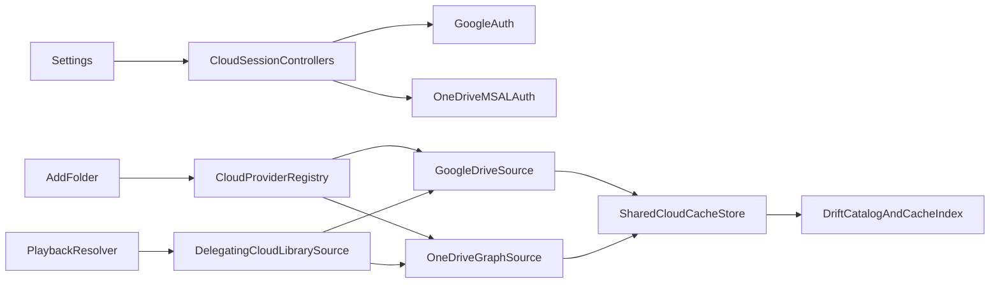

# OneDrive Cloud Provider Implementation Plan

## Locked product decisions

- Support Android only in this rollout; iOS remains out of scope.
- Support personal Microsoft accounts only, rooted at the user’s own OneDrive “My files”. Do not add work/school tenants or a separate “Shared with me” surface.
- Request least privilege: delegated `Files.Read` plus MSAL identity scopes (`User.Read`, `openid`, `profile`). Do not request `offline_access` explicitly (personal MSA declines it). Never request `Files.Read.All` or a write scope.
- Google Drive and OneDrive may be signed in and used simultaneously.
- Keep one shared cloud-cache budget and one global “Clear cloud cache” action. Normal provider sign-out wipes only that provider’s downloaded audio/artwork; catalog roots and queue entries remain.
- Apply the same account-change rule to Google Drive and OneDrive: a newly authenticated account cannot silently take ownership of another account’s roots. The user must confirm replacement; confirmation forgets that provider’s old roots, tracks, queue rows, cache, and artwork. Cancellation signs out the newly authenticated session without deleting existing library data.
- Use `msal_auth` as a third-party bridge to native Microsoft MSAL, subject to an early device spike. If the spike fails a hard gate, preserve the Dart interface and replace only the bridge with a custom MethodChannel around official MSAL Android. Do not fall back to generic AppAuth without a new decision.
- Accept Microsoft’s “Unverified” publisher label for the first public GitHub APK. Publisher verification is not a release gate.
- Use official Microsoft OneDrive/Microsoft sign-in assets and branding rules; do not redraw, recolor, or generate substitutes.
- Preserve TinyTunes’ read-only cloud rule: list/download/cache only, never create, rename, overwrite, move, or delete remote OneDrive content.
- Keep shared cloud contracts, routing, cache, free-space, and Riverpod composition directly under `lib/core/cloud/`; place every provider-specific auth, locator, API/remote, source, and OAuth configuration file under a dedicated `google_drive/` or `one_drive/` subfolder. Mirror the same organization under `test/core/cloud/`. Spike probes are not retained in production.

## Target architecture

- Keep `sourceKind = 'cloud'`; do not create provider-specific source kinds.
- Introduce `CloudProviderId.googleDrive` and `CloudProviderId.oneDrive` with canonical persisted tokens `gdrive` and `onedrive`.
- Preserve existing `gdrive:<fileId>` locators.
- Define OneDrive locators as opaque, canonical values containing both the Graph drive ID and item ID, with each component escaped by one shared codec. Reserve a non-persisted personal-root sentinel for the folder browser; selected roots and tracks always use stable drive/item IDs.
- Route every `CloudLibrarySource` call by locator prefix through a delegating registry, preserving the existing source contract used by ingest and playback.
- Add nullable `cloud_provider` and `cloud_account_key` to `library_roots`; tracks inherit ownership through `rootId`. Use the provider’s stable account identifier, never email, as the ownership key.
- Add per-provider session state on top of a shared auth/session abstraction. UI owns confirmation dialogs; session/domain code exposes a pending account-change state and performs deterministic confirm/cancel actions.
- Store new downloads under provider-separated directories such as `cloud_cache/gdrive/...` and `cloud_cache/onedrive/...`. Existing indexed Google cache paths may age out normally because cache rows already store absolute paths.
- Retain descriptive provider-prefixed filenames and class names inside provider folders (for example `google_drive_auth.dart` and `one_drive_auth.dart`); do not introduce ambiguous `auth.dart` files or barrel exports.

```text
lib/core/cloud/
├── cloud_library_source.dart
├── cloud_provider_id.dart
├── cloud_media_locator.dart
├── delegating_cloud_library_source.dart
├── cloud_providers.dart
├── cloud_cache_store.dart
├── cloud_cache_budget.dart
├── cloud_cache_budget_preferences.dart
├── free_space_source.dart
├── android/
├── google_drive/
│   ├── google_drive_auth.dart
│   ├── google_drive_oauth_config.dart
│   ├── google_drive_media_locator.dart
│   ├── google_drive_remote.dart
│   ├── google_api_drive_remote.dart
│   ├── google_access_token_client.dart
│   └── google_drive_cloud_library_source.dart
└── one_drive/
    ├── one_drive_auth.dart
    ├── one_drive_oauth_config.dart
    ├── one_drive_media_locator.dart
    ├── one_drive_remote.dart
    ├── one_drive_graph_http.dart
    ├── one_drive_graph_remote.dart
    ├── one_drive_cloud_library_source.dart
    └── one_drive_error_redaction.dart
```

The test tree mirrors `google_drive/` and `one_drive/`; genuinely shared cache/router/contract tests remain directly under `test/core/cloud/`.



## Phase 0 — Record the contract and prepare the external configuration

### Implementation

- Add ADR 0003 documenting personal-OneDrive-only scope, read-only Graph access, locator format, simultaneous providers, shared cache budget, root account ownership, provider-scoped sign-out, and the `msal_auth` fallback boundary.
- Treat [`docs/research/onedrive-oauth-public-effort.md`](docs/research/onedrive-oauth-public-effort.md) as the primary setup research and link it from the ADR.
- In Microsoft Entra, create one public-client registration supporting **Personal Microsoft accounts only**.
- Add Microsoft Graph delegated `Files.Read`; configure native public-client auth with no client secret.
- Register Android platform entries for package `at.blumenlaube.tinytunes` with both debug and release signing-certificate hashes. Record the resulting `msauth://...` redirect URIs outside secrets storage; the client ID and redirect URI are public configuration.
- Configure app name/logo, existing privacy-policy URL, and terms URL if available. Explicitly document that sideloaded GitHub APKs are supported and publisher verification is deferred.
- Acquire official OneDrive and Microsoft sign-in brand assets from Microsoft’s brand resources and retain source/license notes.

### Automated gate

- ADR contains every locked decision above and does not contradict ADR 0002; ADR 0002 is cross-linked as the original Google decision.
- Repository secret scan/diff review confirms no client secret, refresh token, tenant credential, or downloaded portal credential file is committed.
- Debug and release package/signature-hash commands are documented reproducibly.

### Manual gate

- Entra portal shows personal-account-only audience, Android debug and release redirect entries, and only read-only delegated file permission.
- Privacy URL is publicly reachable.
- Official branding assets and their permitted use are visually/legal reviewed.
- Stop if a confidential-client secret appears necessary; mobile auth must remain a PKCE/public-client flow.

### Phase 0 status (2026-08-08)

**COMPLETE — automated + manual gates green.** Ready for Phase 1 on request.

Completed in repo:

- ADR [`docs/adr/0003-onedrive-cloud-library.md`](../../docs/adr/0003-onedrive-cloud-library.md); ADR 0002 cross-link; CONTEXT glossary/ADR index.
- OAuth/signing doc expanded for Microsoft; maintainer client ID, debug/release signature hashes + redirect URIs recorded (public binding values).
- Official brand assets acquired under `assets/branding/` + [`docs/legal/microsoft-brand-assets.md`](../../docs/legal/microsoft-brand-assets.md); declared in `pubspec.yaml`.
- Privacy drafts EN/DE updated for optional personal OneDrive.
- Contract tests: `test/docs/adr_0003_onedrive_contract_test.dart`, `test/docs/oauth_secret_scan_test.dart` (11 passed).
- `key.properties` / `*.jks` remain gitignored and untracked.

Maintainer Entra confirmation (screenshots 2026-08-08):

- Application (client) ID: `c2ed77e3-5443-4251-94c2-b6e1916d084d`
- Audience: `PersonalMicrosoftAccount` / `consumers`
- Android platforms: debug + release hashes match the table below
- Graph delegated: `Files.Read`, `User.Read` only (no write / no `Files.Read.All`)
- Branding: name TinyTunes, logo, homepage, privacy, and ToS URLs on blumenlaube.at (portal green checks)
- Publisher: `*.onmicrosoft.com` → consent **Unverified** (accepted; no Partner verification)

Important findings retained for later phases:

1. Prefer Microsoft symbol + localized text over English-only pre-rendered sign-in PNGs for DE/EN.
2. OneDrive product icon is the Fabric CDN `onedrive_96x1.png`.
3. `offline_access` was not listed as a static Graph permission in the portal. Device gate later showed personal MSA **declines** an explicit `offline_access` request; do not request it in Dart scopes (see Phase 1 findings).
4. No client secret was created (correct public-client posture).

| Build | Signature hash (Base64) | Redirect URI |
| --- | --- | --- |
| Debug | `kNrKEKVATPOALWoi2IiGqfnphGM=` | `msauth://at.blumenlaube.tinytunes/kNrKEKVATPOALWoi2IiGqfnphGM%3D` |
| Release | `yA+8T1x4a9pYEu1mYe58Quq7f5Y=` | `msauth://at.blumenlaube.tinytunes/yA%2B8T1x4a9pYEu1mYe58Quq7f5Y%3D` |

## Phase 1 — Prove Microsoft auth before building feature code

### Status

**COMPLETE** (2026-08-08). Automated + manual device gates passed. Proceeding to Phase 2.

### Implementation

- Add `msal_auth`, a minimal `OneDriveAuth` abstraction under [`lib/core/cloud/one_drive/`](lib/core/cloud/one_drive/), and an adapter using `SingleAccountPca` in single-account mode with the consumer authority and system-browser authentication.
- Add Android MSAL configuration and `BrowserTabActivity` callback/intent-filter using the registered package and signature hash. Keep personally identifying MSAL logging disabled.
- Implement interactive sign-in, current-account restore, silent `Files.Read` token acquisition, auth-only sign-out, and account identity mapping (`stableAccountKey`, display email).
- Add a temporary diagnostic probe that performs `GET /me/drive/root/children`, follows Graph pagination, and renders/logs only safe item summaries through `debugPrint`.
- Keep the spike isolated behind interfaces so it can be removed or retained without coupling Settings, ingest, or playback to plugin types.

### Delivered

- `msal_auth: 3.5.2`; `assets/msal_config.json` (SINGLE + BROWSER, `pii_enabled: false`, PersonalMicrosoftAccount/consumers)
- `lib/core/cloud/one_drive/` — OAuth config, `MsalOneDriveAuth`, probe, error redaction
- Settings OneDrive section (sign-in / List My files / sign-out); auth-only sign-out (no cache wipe)
- Android: `BrowserTabActivity` + debug/release `msalSignaturePath`; packaging excludes for MSAL/tika `META-INF` clashes
- Unit/session/probe/redaction tests under `test/core/cloud/one_drive/`
- Scopes requested at runtime: Graph `Files.Read`, `User.Read`, plus `openid` / `profile` (no explicit `offline_access`)

### Automated gate

- Unit tests cover auth-result mapping, cancellation, silent-token success, UI-required failure, sign-out, and redaction of token/PII-bearing errors. **PASS**
- Static analysis passes; Android debug and release variants compile. **PASS** (`app-debug.apk`, `app-release.apk`)
- Dependency/license review confirms `msal_auth` wraps native MSAL, supports the project’s Android SDK levels, and does not require secrets. **PASS** (public client ID only; no secret)

### Findings

1. `mergeDebugJavaResource` failed on duplicate `META-INF/DEPENDENCIES` (tika from audiotags vs Apache HTTP from MSAL). Fixed with `android.packaging.resources.excludes` in `android/app/build.gradle.kts`.
2. Device sign-in: server **granted** `Files.Read` / `User.Read` / `openid` / `profile` but **declined** `offline_access`; `msal_auth` treats any declined scope as hard failure (`MsalDeclinedScopeException`). Fix: stop requesting `offline_access` explicitly; silent restore verified on device without it.
3. **Release-signed APK** (maintainer keystore): Microsoft sign-in, List My files, and session restore work with the release `msauth://` hash — release redirect gate **PASSED** (2026-08-08).

### Manual gate — hard stop/go checkpoint

On a physical Android device using a personal Microsoft account:

1. Install a debug APK and complete browser sign-in.
2. Confirm consent requests read-only file access and no write/admin permission.
3. List a paginated “My files” root containing at least a folder and a file.
4. Kill/restart the app and confirm silent session restoration/token acquisition.
5. Sign out and confirm the app’s MSAL session is gone; sign-in works again.
6. Repeat with a release-signed APK to prove its separately registered signature hash.
7. Confirm public consumer login is not restricted to a test-user list and the accepted “Unverified” label is the only trust warning.

If any redirect, restore, silent-token, release-signature, personal-account, or build-compatibility gate cannot be made reliable, stop and replace `msal_auth` with a custom MethodChannel around official MSAL Android. Re-run this entire gate before proceeding.

**Manual gate: PASSED** (2026-08-08) — debug + **release** APK gates green (sign-in/out, Files.Read, My files listing, kill/restart silent restore, release signature hash).

**Do not start Phase 2 until this manual gate passes.** ← unlocked.

## Phase 2 — Make the existing Google implementation multi-provider-safe

### Status

**COMPLETE** (2026-08-08). Automated + manual Google regression gates passed. Proceeding to Phase 3.

### Implementation

- Before adding production OneDrive code, move all existing Google-only files from the flat cloud directory into [`lib/core/cloud/google_drive/`](lib/core/cloud/google_drive/) and mirror their tests under [`test/core/cloud/google_drive/`](test/core/cloud/google_drive/). Use Git-aware moves where practical so history remains reviewable.
- Rename moved files only where the current name is provider-ambiguous: `drive_media_locator.dart` → `google_drive_media_locator.dart` and `drive_remote.dart` → `google_drive_remote.dart`. Keep existing public class behavior and the persisted `gdrive:` format unchanged.
- Keep shared contracts and infrastructure at [`lib/core/cloud/`](lib/core/cloud/): `CloudLibrarySource`, provider identity/locator parsing, delegating source/router, Riverpod composition, cache/budget, free-space abstractions, and the existing platform-specific `android/` implementation.
- Update imports, `part` directives/generated outputs, documentation links, and test paths as one mechanical refactor; do not add barrel exports or transitional duplicate files.
- Add `CloudProviderId`, a shared cloud-locator parser, and a provider registry/delegating `CloudLibrarySource` under [`lib/core/cloud/`](lib/core/cloud/).
- Keep [`lib/core/cloud/google_drive/google_drive_media_locator.dart`](lib/core/cloud/google_drive/google_drive_media_locator.dart) backward compatible and add the OneDrive codec under [`lib/core/cloud/one_drive/`](lib/core/cloud/one_drive/) plus unknown/malformed-prefix failures.
- Split the production source providers into Google, OneDrive, and delegating/router providers in [`lib/core/cloud/cloud_providers.dart`](lib/core/cloud/cloud_providers.dart).
- Change [`lib/features/player/application/playback_uri_resolver.dart`](lib/features/player/application/playback_uri_resolver.dart), [`lib/features/player/application/playback_controller.dart`](lib/features/player/application/playback_controller.dart), and cloud rescan paths to resolve a source from the track/root locator rather than assuming Google.
- Add `CloudCacheStore.clearForProvider` using canonical locator prefixes. Keep `clearAll` for the shared global action and global LRU enforcement for the shared budget.
- Change Google sign-out from global `clearAll()` to Google-only cleanup.
- Put new Google downloads in the `gdrive` cache subdirectory; retain valid legacy indexed paths until ordinary deletion/eviction.
- Fix the discovered prune gap: before cloud tracks removed by rescan are deleted from Drift, delete their indexed audio files and artwork. Queue-only removal continues to preserve the catalog track and its tag/album fields while deleting that queue row’s cache/artwork according to existing semantics.

### Delivered

- Google modules under `lib/core/cloud/google_drive/` (+ mirrored tests)
- `CloudProviderId`, `CloudMediaLocator`, `DelegatingCloudLibrarySource`, `OneDriveMediaLocator` (`onedrive:<drive>/<item>`, personal-root sentinel)
- `cloudLibrarySourceProvider` → delegating router (Google registered; OneDrive source later)
- `clearForProvider`; Google sign-out scoped; downloads under `cloud_cache/gdrive/…` with legacy resolve fallback
- Rescan prune deletes cloud cache before catalog row removal

### Automated gate

- Run formatting/code generation after the moves; static analysis must report no stale imports, missing `part` files, duplicate symbols, or old flat provider paths. **PASS**
- All existing Google tests must pass once immediately after the folder-only refactor, before locator/router/cache behavior changes are layered on top. **PASS**
- A repository search confirms provider-specific production files exist only under `google_drive/` or `one_drive/`, while shared files do not import provider implementation details except in the root Riverpod composition/registry. **PASS**
- Locator tests cover both prefixes, round trips, escaped OneDrive IDs, personal-root sentinel rejection for persistence, and malformed/unknown locators. **PASS**
- Router tests prove Google locators never invoke OneDrive and vice versa. **PASS**
- Cache tests prove provider-scoped clear, global clear, cross-provider shared LRU, queue removal, root forget, and prune remove exactly the intended audio/artwork files and rows. **PASS** (scoped clear + existing suite)
- Existing Google ingest, playback, tag enrichment, artwork, queue, and settings tests remain green. **PASS**
- Full `flutter analyze` and focused cloud/player/library test suites pass. **PASS** (focused)

### Manual gate

- Review the Phase 2 diff separately: file moves/import updates must be distinguishable from behavioral multi-provider changes, and Git history for Google implementation files must remain traceable.
- On the existing Google-enabled device, sign in, browse, import recursively, download/play, resolve tags/artwork, replay from cache, remove/re-add a queue entry, rescan, forget, clear cache, and sign out.
- Confirm this refactor introduces no Google-visible behavior change except provider-scoped sign-out internals.

**Manual gate: PASSED** (2026-08-08) — Google device regression green; no regressions found (sign-in, browse/import, play/cache, queue, rescan, forget, clear, sign-out).

**Do not start Phase 3 until this manual gate passes.** ← unlocked.

## Phase 3 — Persist provider/account ownership and implement safe account replacement

### Status

**COMPLETE** (2026-08-08). Automated + manual two-account replacement gates passed. Proceeding to Phase 4.

### Implementation

- Bump Drift schema and add nullable `cloud_provider` and `cloud_account_key` to `library_roots` in [`lib/core/database/tables.dart`](lib/core/database/tables.dart), with migration/backfill in [`lib/core/database/app_database.dart`](lib/core/database/app_database.dart).
- Backfill existing `gdrive:` roots to provider `gdrive`. Because historic rows lack an account key, bind those null-key roots once to the first successfully restored/signed-in Google account after upgrade; all subsequently created roots always receive an account key.
- Extend [`lib/core/database/catalog_dao.dart`](lib/core/database/catalog_dao.dart) with provider/account root queries and root upsert ownership arguments.
- Generalize Google account data to expose its stable Google account ID; map OneDrive’s stable MSAL account identifier. Never use mutable email as ownership identity.
- Add per-provider session controllers/states with `signedOut`, `busy`, `signedIn`, `accountChangeRequired`, and `error` outcomes.
- On a differing account with existing owned roots, block provider operations and expose the old/new display identities for UI confirmation.
- Confirm replacement: delete all old-account roots for that provider through the normal forget/cascade path, including queue rows, cache, and artwork; then accept the new account.
- Cancel replacement: perform auth-only sign-out of the newly authenticated session, retain all old roots/queue/cache/artwork, and return to signed-out state.
- Normal sign-out remains non-destructive to catalog/queue and clears only that provider’s cache/artwork.

### Delivered

- Schema v3: nullable `cloud_provider` / `cloud_account_key`; locator-prefix backfill; first-sign-in bind of unbound roots
- `GoogleDriveAccount.stableAccountKey` from `GoogleSignInAccount.id`
- Shared `CloudAccountOwnership` + confirm/cancel on Google and OneDrive session controllers
- Settings replacement confirmation dialog (EN/DE); ops blocked while pending
- Cloud ingest writes ownership on new Google roots; OneDrive sign-out clears OneDrive cache only
- Last-known display email persisted in SharedPreferences for replacement dialog copy

### Automated gate

- Migration tests cover local roots, existing `gdrive:` roots, null legacy ownership, and fresh OneDrive roots. **PASS**
- DAO tests cover provider/account filtering and ensure one provider cannot delete another’s roots. **PASS**
- Session tests cover normal restore, same-account reauthentication, different-account pending state, confirm replacement, cancel replacement, and provider-scoped normal sign-out for both Google and OneDrive. **PASS**
- Tests prove provider operations are rejected while an account change is unresolved. **PASS**

### Findings

1. Previous account email for the replacement dialog is not stored on roots (ownership key only). Persisted as `cloud_account_display_<provider>` in SharedPreferences on successful accept/bind.
2. Unbound (`cloud_account_key` null) roots alone do not trigger replacement — they bind to the first successful account. Conflict requires at least one foreign non-null key.
3. OneDrive normal sign-out now matches Google: provider-scoped cache wipe (catalog stays).

### Manual gate

For both Google and personal OneDrive, using two accounts:

1. Import a folder with account A.
2. Sign out; verify roots/queue remain and only that provider’s cache/artwork is wiped.
3. Authenticate account B; verify a blocking replacement confirmation appears before provider operations continue.
4. Cancel; verify account-A catalog/queue/cache state is unchanged and account B is signed out.
5. Repeat and confirm; verify account-A roots, tracks, queue rows, cache, and artwork are removed, while the other provider is untouched.

**Do not start Phase 4 until this manual gate passes.**

## Phase 4 — Implement the production OneDrive Graph source

**COMPLETE** (2026-08-08). Automated + manual Graph list/download gates passed. Proceeding to Phase 5.

### Implementation

- Add an authenticated Graph HTTP client under [`lib/core/cloud/one_drive/`](lib/core/cloud/one_drive/) that asks `OneDriveAuth` for a silent token and sends Bearer authentication only to Microsoft Graph endpoints.
- Add `OneDriveRemote` and its production Graph implementation in the OneDrive provider folder, parallel to the Google remote seam under [`lib/core/cloud/google_drive/`](lib/core/cloud/google_drive/).
- Implement own-drive root listing and nested child listing using `/me/drive/root/children` and `/drives/{driveId}/items/{itemId}/children`; request only needed fields and consume every `@odata.nextLink` page.
- Implement metadata and streamed `/content` download with progress, safe temporary-file handling, free-space checks, sanitized local filenames, atomic completion, and cleanup after cancellation/failure. Never persist a temporary preauthenticated download URL or forward the Graph bearer token to a non-Graph download host.
- Add `OneDriveCloudLibrarySource`: filter to supported audio extensions, sort identically to Google, emit canonical drive/item locators, resolve cache, and write under `cloud_cache/onedrive/...`.
- Map 401/interaction-required to provider-auth messaging; treat 404/deleted items as missing during rescan or unplayable during playback; surface throttling/network failures through the existing session-message/toast path without remote mutation.

### Automated gate

- Fake-HTTP/remote tests cover root/nested listing, pagination, folders, audio filtering, duplicate names with distinct IDs, modified/size parsing, metadata, redirects, progress, insufficient space, interrupted download cleanup, cache hit/miss, 401, 404, 429, and malformed responses. **PASS**
- Contract tests run the same ordering/list/download/cache expectations against Google and OneDrive source implementations. **PASS**
- Static analysis and all core cloud tests pass. **PASS** (`test/core/cloud` — 71 tests)

### Findings

1. `/content` redirects are followed manually with `followRedirects: false`; Authorization is attached only when `isMicrosoftGraphHost` is true (CDN preauth URLs never get the Graph bearer).
2. Downloads write to `*.partial` then rename atomically; failures delete the partial file.
3. Temporary Settings harness (`List My files` / `Test Graph list/download` / `exerciseGraphSource`) used for the manual gate; **removed in Phase 5** in favor of the real folder browser.
4. Manual: nested Musik browse, two MP3 downloads to `cloud_cache/onedrive/…`, remote delete reflected as fewer children on next list (no Graph write).

### Manual gate

- **PASSED** (2026-08-08): nested list + two audio downloads; remote delete visible on next list.

## Phase 5 — Add complete UI, settings, localization, and branding

**COMPLETE** (2026-08-08). Automated + manual branding/UI gates passed. Proceeding to Phase 6 on request.

### Implementation

- Official OneDrive mark and Microsoft sign-in widget under [`lib/shared/widgets/`](lib/shared/widgets/) (assets already in `pubspec.yaml`).
- Settings: Google + OneDrive account sections + provider-neutral shared cache (slider/clear stay enabled independent of provider busy).
- **Spike cleanup:** removed Settings `List My files` / `Test Graph list/download`, `exerciseGraphSource`, `listMyFilesRoot`, session `rootEntries`, and `OneDriveProbe` / probe providers (production browsing is the folder dialog).
- Three-way source picker (device / Google / OneDrive) with official marks.
- Provider-configured cloud folder browser: Google “My Drive”, OneDrive “My files”; virtual roots not selectable.
- Playlist home + ingest pass `CloudProviderId`, enforce that provider’s session, stamp ownership.
- Both provider sessions already restored from [`lib/main.dart`](lib/main.dart).
- EN/DE ARB: OneDrive picker, browser roots, provider-specific sign-in-required; spike strings removed; cache clear copy provider-neutral.

### Automated gate

- Widget/unit tests cover settings sections, three-way picker, folder navigation, virtual-root non-selection, cloud ingest with provider param. **PASS**
- Localization generation, static analysis, and settings/library/cloud tests pass. **PASS**

### Manual gate

- **PASSED** (2026-08-08): branding/UI review green; Add folder → OneDrive browse/import works; Settings spike buttons gone.
- Follow-up: cloud folder list shows a persistent scrollbar plus a bottom fade/chevron when more rows are below the viewport.

**Do not start Phase 6 until this manual gate passes.** ← unlocked.

## Phase 6 — Prove end-to-end feature parity and destructive cleanup

**COMPLETE** (2026-08-08). Automated + manual device parity matrix passed. Proceeding to Phase 7.

### Implementation

- Production pipeline already shared via `DelegatingCloudLibrarySource`; Phase 6 focused on cleanup + parameterized parity coverage.
- Settings “Clear cloud cache” calls `cloudCacheStoreProvider.clearAll()` directly (provider-neutral); removed Google-session `clearCloudCache` helper and leftover Drive/Graph probes.
- Parameterized Google/OneDrive parity matrix: flat/recursive import, ownership stamp, rescan prune (+ cache), forget root, queue remove preserves catalog tags, shared cross-provider LRU budget.
- Extended OneDrive session scoped sign-out cache wipe, queue-actions OneDrive + tag-preserve case, OneDrive download-on-play/cache-hit in playback URI resolver.

### Automated gate

- Parameterized suite in `test/features/library/cloud_parity_matrix_test.dart` plus scoped OneDrive sign-out, queue OneDrive, and playback OneDrive cases. **PASS**
- Full `flutter test` / analyze green. **PASS**

### Manual gate — parity matrix on a physical device

1. Keep Google and OneDrive signed in simultaneously.
2. Import flat and recursive folders from both providers into one queue.
3. Play uncached tracks from each provider; observe progress, tags/album/artwork, then replay from cache.
4. Remove/re-add entries, clear queue, lower the shared budget, and clear all cloud cache.
5. Remotely add and delete test files, then rescan and verify queue/catalog/cache/artwork outcomes.
6. Forget one provider’s root and verify the other provider remains intact.
7. Sign each provider out separately and verify scoped cleanup.
8. Exercise offline, expired-consent, revoked-consent, 404, insufficient-space, and interrupted-download paths.
9. Verify OneDrive’s remote contents remain byte-for-byte and structurally unchanged throughout.

**PASSED** (2026-08-08): maintainer reported all green.

## Phase 7 — Public APK release gate and documentation handoff

**COMPLETE** (2026-08-08). Docs + automated + manual release-APK gates passed. Shipped as **v1.1.0**.

### Implementation

- Update [`docs/features/cloud-library.md`](docs/features/cloud-library.md) from Google-only to multi-provider behavior, setup, account replacement, shared-cache semantics, and the end-to-end smoke matrix.
- Update [`docs/features/README.md`](docs/features/README.md), [`CONTEXT.md`](CONTEXT.md), OAuth/legal setup docs, README claims, and [`docs/CHANGELOG.md`](docs/CHANGELOG.md).
- Document fork/self-build requirements: their own Entra client registration and signature hashes; no client secret; personal accounts only; `Files.Read`; debug/release redirect entries.
- Record dependency/asset licenses and the accepted unverified-consent posture.
- Remove any temporary spike-only UI/probes that are not valuable diagnostics, while retaining tests and provider interfaces.

### Automated gate

- Fresh dependency resolution, localization/code generation, formatting, full analysis, full tests, and release APK build pass from a clean checkout.
- Release artifact inspection confirms the expected public client ID/redirect configuration and no secret/token/credential files.
- Documentation links, privacy URL, asset declarations, and changelog/index entries are valid.

**PASS** (2026-08-08): `flutter pub get`, gen-l10n, analyze (no warnings/errors), full tests, `flutter build apk --release`; APK embeds Entra client ID in libapp.so; `key.properties`/`.jks` gitignored; no client-secret patterns in unpacked APK config files.

### Manual release gate

- Install the release-signed APK from the same distribution path end users will use.
- Sign in with a personal Microsoft account that was never used during development and is not whitelisted anywhere.
- Repeat the essential flow: sign in, browse “My files”, import recursively, download/play, resolve metadata/artwork, restart/cache hit, provider sign-out, and sign-in restore.
- Confirm only the accepted “Unverified” publisher presentation appears—no admin-consent, work/school, test-user, redirect, or signature error.
- Re-run a concise Google regression and simultaneous-provider isolation check on the same release build.
- Release only after every automated and manual gate is recorded as pass; failed gates return to the owning phase rather than being waived implicitly.

**PASSED** (2026-08-08): maintainer reported manual release-APK gate green (fresh personal MSA, Unverified-only consent, Google regression + simultaneous providers).

**VERIFY PASS** (2026-08-08): plan vs codebase audit closed remaining gaps (probe index delete, ADR `offline_access` wording, architecture tree filenames, Phase 6 automated bullets, feature-doc widget paths).

## Explicit non-goals

- Work/school/business tenants, tenant-admin consent, and Microsoft publisher verification.
- iOS OneDrive support in this rollout.
- Separate “Shared with me”, Recent, Photos, SharePoint, Teams, or multiple signed-in OneDrive accounts.
- `Files.Read.All`, write scopes, or any remote write/delete/rename/move operation.
- Per-provider cache budgets, progressive play-while-downloading, or provider-specific queue models.
- Replacing the existing catalog/queue domain semantics or changing `sourceKind` away from generic `cloud`.