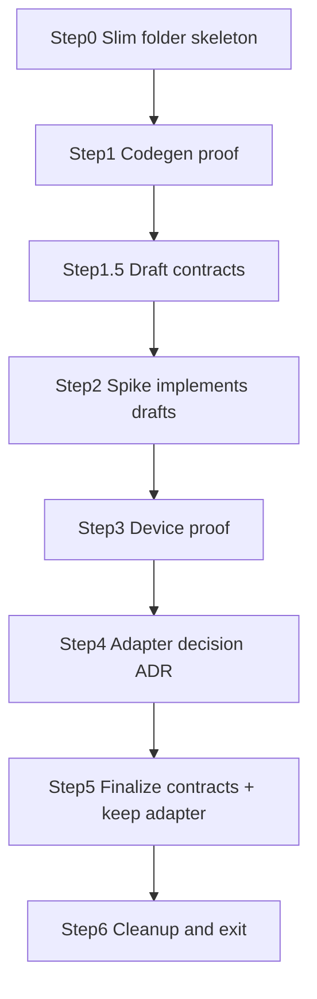

# Phase 0 — Feasibility and dependency gate

## Locked inputs (from roadmap + your answers + plan review)

- Physical Android phone available for the retain-after-reboot proof.
- Spike UI is **throwaway**: delete after exit; keep **contracts + ADR + slim Android adapter** only.
- Domain must not bake plain `File` paths; opaque locators only.
- **Storage reality (hardened):** locked `file_picker` **11.0.2** has **no** `takePersistableUriPermission` / no `AndroidSAFOptions` (those land in **12.x beta**). Treat a **narrow MethodChannel SAF adapter** (pick + persist READ + list + open) as the **default** path — not a rare fallback. Optional: try `file_picker` **12.x beta** only for picker UX / persist grant; still need DocumentsContract list/open behind the same contracts. Never leak `file_picker` types into domain.
- No product UI, Drift schema, or feature modules yet — those start in Phase 1–2.
- **Step 0 first:** scaffold empty durable `lib/` (and docs) folders before codegen/spike so later steps drop into known homes.

## Current baseline

- [`pubspec.yaml`](pubspec.yaml): full stack declared; `analyzer: 10.0.1` + `freezed_annotation` overrides already noted as risk (`riverpod_generator` wants analyzer ^12, `freezed` wants &lt;11).
- Locked: `file_picker` **11.0.2** — path/URI string from directory pick only; not a retainable library root.
- [`lib/main.dart`](lib/main.dart): minimal `ProviderScope` + localized title shell.
- [`lib/`](lib/): only `main.dart` + `l10n/` — no `core` / `features` / `shared`.
- [`test/widget_test.dart`](test/widget_test.dart): pumps `MainApp()` **without** `ProviderScope`; expects `Text('TinyTunes')`.
- No `build.yaml`, no `docs/adr/`, no contracts, no storage permissions in [`AndroidManifest.xml`](android/app/src/main/AndroidManifest.xml) (correct for SAF-first).



---

## Step 0 — Slim folder structure (empty skeleton)

**Goal:** Durable homes for Phase 0 artifacts and Phase 1–2 drop-ins. **Placeholders only** (`.gitkeep`); no screens, providers, or schema.

**Create this tree** (keep existing `lib/main.dart` and `lib/l10n/` as-is):

```text
lib/
  main.dart                 # already exists
  l10n/                     # already exists
  core/
    library/                # contracts + android/ adapter (Steps 1.5–5)
      android/              # slim AndroidLocalLibrarySource (kept after spike)
    cloud/                  # CloudLibrarySource stub (Step 5)
  shared/
    widgets/                # shared Material widgets (empty until Phase 1)
  spike/                    # throwaway Phase 0 UI + codegen_smoke (deleted in Step 6)
    codegen_smoke/          # Step 1 disposable generators

docs/
  adr/                      # Step 4 ADR lands here
  features/                 # empty .gitkeep only — no feature docs in P0
  agents/                   # already exists — leave alone
```

**Do not create in Phase 0** (YAGNI — add when the phase that fills them arrives): empty `features/{playlist,player,...}/{data,domain,presentation}`, `core/{database,routing,theme,messages}`. Phase 1 owns feature-first product folders; Phase 0 already provides `core/library` + `core/cloud` + `shared/widgets`.

**Rules for Step 0:**

- One `.gitkeep` per otherwise-empty directory so Git tracks the tree.
- Do **not** add barrel `export` files, README spam, or stub classes in Step 0.
- Do **not** move `l10n/` or change `main.dart` yet.
- Empty dirs are placeholders only — **do not** add screens/providers under future feature paths in Phase 0.

**Exit:** Tree exists on disk; `flutter analyze` / existing widget test still pass (no Dart code added).

---

## Step 1 — Codegen compatibility proof (no product schema)

**Goal:** One clean `build_runner` run covering Riverpod, Freezed, Drift, JSON, and typed `go_router` routes; then analyze + tests. Record the final pin set for the ADR (Step 4).

**KISS approach:** Add a **disposable smoke fixture** under `lib/spike/codegen_smoke/` (deleted in Step 6). **One concern per file:**

- One `@riverpod` provider (`part '*.g.dart'`)
- One `@freezed` model with `fromJson`/`toJson` factory (`part '*.freezed.dart'` + `part '*.g.dart'`). **Do not** also stack `@JsonSerializable` on the same class (Freezed 3 footgun).
- One minimal Drift table + database (in-memory / not wired to `main`)
- One `@TypedGoRoute` for `go_router_builder` (compile-only; need not wire `MaterialApp.router` yet)

**Do not** introduce production `library_roots` / queue tables here.

**`build.yaml`:** not required initially. Add only if the first `build_runner` run shows builder conflicts — do not cargo-cult.

**Commands (exit for this step):**

```text
dart run build_runner build --delete-conflicting-outputs
flutter analyze
flutter test
```

**If codegen fails:** repin packages (or drop incompatible overrides) until the five generators succeed together — do not paper over with more analyzer overrides. After any repin, sanity-check that `audiotags` still resolves (it wanted `freezed_annotation` ^2; override forces ^3). Document the final pin set in the ADR Dependencies section.

**Keep the smoke fixture until Step 6**, then delete **sources and** generated `*.g.dart` / `*.freezed.dart` companions so Phase 1 does not inherit a fake DB.

---

## Step 1.5 — Draft contracts (signatures only)

**Goal:** Spike implements a known Flutter API instead of inventing a parallel one that Step 5 renames.

**Location:** `lib/core/library/` and `lib/core/cloud/` — abstract APIs + throwing cloud stub. No Riverpod feature modules. Annotation-free preferred so Step 6 smoke deletion leaves a clean tree.

| Contract | Draft intent (tighten in Step 5 from ADR) |
|----------|-------------------------------------------|
| `MediaLocator` | Opaque serializable `String` token; `==`/`hashCode` on exact stored string (normalize once at write: Android `Uri.toString()`). Root = tree URI; item = document-under-tree URI — do not intermix. |
| `LocalLibrarySource` | `pickAndRetainRoot()` → root locator; `listChildren(parent)` → entries `{locator, name, isDir}`; `resolvePlaybackUri(item)`; `materializeReadablePath(item)` for tags (caller deletes / try/finally) |
| `TrackMetadataReader` | Read title/artist/album/artwork from a readable path/source; swappable impl |
| `CloudLibrarySource` | Read-only stub: `list` / `downloadToCache` / `resolveCached` → `UnimplementedError` (Phase 7) |

**Native MethodChannel surface (KISS — implement in spike, keep under `lib/core/library/android/` + Kotlin under `android/app/src/main/kotlin/at/blumenlaube/tinytunes/`):**

| Method | Purpose |
|--------|---------|
| `pickAndPersistTree()` → `String` | `ACTION_OPEN_DOCUMENT_TREE` + `takePersistableUriPermission` **READ** |
| `listChildren(treeUri, docId?)` | One level via DocumentFile / DocumentsContract |
| `openRead(documentUri)` | Prefer `openFileDescriptor("r")`; copy-to-cache only for `audiotags` |
| `hasPersisted(treeUri)` / `listPersisted()` | Proof diagnostics |
| `release(treeUri)` | Hygiene |

Skip write APIs, MediaStore indexing, and catalog upsert.

---

## Step 2 — Minimal spike harness (throwaway UI)

**Goal:** Smallest screen that drives the device proof — implements draft `LocalLibrarySource`, not product IA.

**Add only:**

- Temporary home override in [`lib/main.dart`](lib/main.dart) → `SpikeScreen` under `lib/spike/` (pick folder, retention status, list nested audio, “read tags”, “play”).
- Spike as plain `StatefulWidget` (**no Riverpod**) so [`test/widget_test.dart`](test/widget_test.dart) can stay green: update the test immediately to assert `find.byType(MaterialApp)` (or a spike `Key`) instead of `Text('TinyTunes')` for the duration of Steps 2–5; restore title assert in Step 6.
- Log after pick: locator string, `persistedUriPermissions` count, child count after list.
- Android: MethodChannel SAF adapter as default. **Do not** add `READ_EXTERNAL_STORAGE` / `READ_MEDIA_*` / `MANAGE_EXTERNAL_STORAGE`. Prefer SAF tree access without broad storage permission. No wake-lock / FGS — background is Phase 3.

**Playback for spike:** plain `just_audio` `AudioPlayer`. Try `AudioSource.uri(Uri.parse(documentUri))` **first**; only then FD/temp. Do **not** init `just_audio_background`.

**Metadata:** `audiotags` is **path-only** (`AudioTags.read(String path)`). Materialize a **bounded** temp file (stream copy to `getTemporaryDirectory()`, hard max e.g. skip/fail &gt;50–100 MB), read tags + artwork, delete in `finally`. Measure whether this is acceptable — feeds ADR.

**Errors:** `debugPrint` only in the spike — do not implement message center / toasts (Phase 1).

---

## Step 3 — Physical device proof checklist

Run on the connected phone. Record pass/fail + device model + API level in the ADR (Step 4).

| # | Check | Pass criteria |
|---|--------|----------------|
| 1 | Select folder | User picks a nested music folder |
| 1b | Locator shape | Stored value is `content://…/tree/…` (or documented exception) |
| 2 | Persist access | Kill app process; reopen; still list children |
| 2b | Persist grant | After pick, URI in `getPersistedUriPermissions()` with read |
| 3 | Survive reboot | Reboot; reopen; same root listable **and** still in persisted permissions |
| 4 | Recursive enumerate | Nested subfolders via DocumentFile/DocumentsContract (**not** `dart:io`) yield audio files; ≥2 levels |
| 5 | Metadata | Title + artist **and** artwork bytes for one file (or ADR records “artwork blocked” as fail — no silent skip) |
| 5b | Temp policy | Temp deleted after tags; one large file (&gt;20 MB) either OK within budget or explicit fail noted |
| 6 | Playback | Prefer direct `content://` via `just_audio`; note if temp required |
| 7 | Optional SD | External-volume tree if device has one |

**Decision rule (hardened):**

- Ship / keep **`AndroidLocalLibrarySource` MethodChannel** if any of: persist fail, list fail, tags-without-usable-path fail, playback fail on document URI.
- “`file_picker`-assisted” is only a pass if 12-beta persist works **and** list/open still sit behind the same contracts — never domain dependence on `file_picker` types.
- Expect native (or 12-beta + list helper) to be the outcome on the pinned 11.0.2 stack.

Do not finalize contracts (Step 5) until this table is filled with evidence.

---

## Step 4 — ADR: storage adapter choice

**Create** [`docs/adr/0001-android-local-library-access.md`](docs/adr/0001-android-local-library-access.md) (first ADR; [`CONTEXT.md`](CONTEXT.md) waits until domain terms stabilize in Phase 2 unless you want a one-paragraph stub).

**ADR must record:**

- Chosen adapter direction (MethodChannel SAF and/or `file_picker` 12-beta assist) + **package versions / pin set** from Step 1.
- Opaque locator shape (exact Android `Uri.toString()` — **not** absolute filesystem paths as identity); root vs item URI rule.
- How playback URI is obtained vs how `audiotags` gets a temporary path (size budget + cleanup).
- Device proof matrix (Step 3 results) including artwork outcome.
- Short **Contract mapping** subsection (which method returns playback `Uri` vs temp path).
- Explicit non-goals: iOS bookmarks (Phase 6), cloud (Phase 7), Drift schema (Phase 2).

**Docs scope:** ADR only in Phase 0. No `docs/features/*` content, no CHANGELOG — Phase 1 bootstraps index/CHANGELOG; library feature docs land with Phase 2. Rule 01 feature docs apply to product modules, not contract stubs (contracts get `///` intent docs).

---

## Step 5 — Finalize contracts (no heavy UI, no full scan pipeline)

**Location:** `lib/core/library/` and `lib/core/cloud/` — tighten drafts from ADR evidence. No Riverpod feature modules yet.

**Always keep** a slim `AndroidLocalLibrarySource` under `lib/core/library/android/` (+ Kotlin channel registration) that passed the checklist behind `LocalLibrarySource`. Delete only `lib/spike/` UI.

**Do not** implement recursive catalog upsert, queue, or Drift writes.

**Required:**

- `///` intent docs on all public contracts, `MediaLocator`, and the kept adapter.
- At least one unit test with fake `LocalLibrarySource` + `TrackMetadataReader`.
- Keep widget test green (title assert restored only after Step 6 shell restore — or keep MaterialApp assert if preferred).

---

## Step 6 — Cleanup and Phase 0 exit

1. Delete spike UI / `lib/spike/` (including `codegen_smoke/` **sources and** `*.g.dart` / `*.freezed.dart`).
2. Restore [`lib/main.dart`](lib/main.dart) to the minimal shell; restore widget test title assert if changed.
3. Ensure remaining tree analyzes cleanly. If contracts are annotation-free, `build_runner` is optional / expect no outputs — do not reintroduce fake schema to “keep codegen warm.”
4. Final gate:

```text
dart run build_runner build --delete-conflicting-outputs   # if any annotations remain
flutter analyze
flutter test
```

5. Confirm ADR + contracts + Android adapter are the durable artifacts; mark Phase 0 done in the roadmap when you merge.

**Phase 0 exit checklist**

- [ ] Slim folder skeleton in place (minus deleted `lib/spike/`)
- [ ] Codegen proof **completed** and pin set recorded in ADR; smoke deleted; analyze + tests clean
- [ ] ADR with adapter choice + device proof matrix (incl. artwork) + contract mapping
- [ ] Four contracts in tree with `///` docs; slim `AndroidLocalLibrarySource` kept behind `LocalLibrarySource`
- [ ] At least one fake-source unit test
- [ ] Spike UI gone
- [ ] No production Drift catalog/queue schema yet
- [ ] No broad storage permissions added for the SAF path

---

## Explicitly out of scope (do not sneak in)

- Typed product routes, message center, toasts, theme catalog (Phase 1)
- Feature presentation shells under `lib/features/...` (Phase 1 creates those folders)
- `library_roots` / `tracks` / `queue_entries` (Phase 2)
- `just_audio_background` / lock screen (Phase 3)
- iOS security-scoped bookmarks (Phase 6)
- Feature docs / CHANGELOG beyond the ADR (Phase 1+ / Phase 2 library docs)
- `READ_MEDIA_*` / `MANAGE_EXTERNAL_STORAGE` / broad storage perms for user-picked folders

## Suggested commit rhythm (when you ask to commit)

1. Slim folder skeleton (Step 0)  
2. Codegen proof / pin fixes  
3. Draft contracts + spike + device evidence → ADR (or squash ADR with contracts)  
4. Finalize contracts + keep adapter + spike UI removal + tests  

Keep commits small; do not commit secrets or local device logs with PII paths if sensitive.

## Roadmap follow-ups (not blocking Phase 0 start)

When Phase 0 merges, tweak roadmap Phase 1 wording:

- “Feature-first folders” → **use Phase 0 skeleton**; fill presentation shells…
- “Keep `CloudLibrarySource`” → **do not recreate**; Phase 0 already added the stub.
