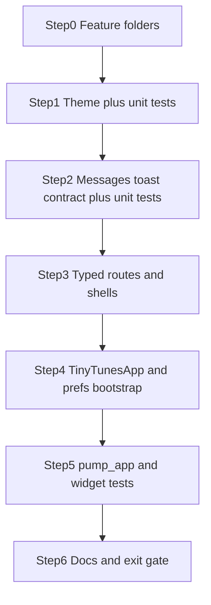

# Phase 1 — App shell and shared infrastructure

## Locked inputs (from roadmap + answers + plan review)

- Reuse Phase 0 tree (`lib/core/library`, `lib/core/cloud`, `lib/shared/widgets`); **do not recreate** `CloudLibrarySource`; do not wire any spike tree into the production router.
- Routes: three top-level typed routes (`/`, `/settings`, `/messages`) via `go_router_builder` (`GoRouteData` + `$appRoutes`); primary nav API = generated typed `.go(context)` helpers (not raw `context.go` as the default).
- Theme: `AppThemeMode` + `ThemeCatalog` with single `default` scheme seed `#88AA00`; prefs-backed providers.
- **Theme UI:** Settings stub only (no mode picker). Mode defaults to **System**. Light/Dark proven by device system theme + provider-override tests (choice **1B**).
- **Demo report path:** button on Messages that fires `reportInfo` + `reportError` (choice **2A**).
- Message store: plain immutable `SessionMessage` (**no Freezed**); max **100**; eviction oldest-first; UI list **newest-first**; severities **info** + **error** only.
- Stable report id field renamed to **`code`** (not `ref` — avoids Riverpod `Ref` collision). Call sites pass already-localized `message` strings.
- Unread: **monotonic watermark** (last-read message id), not timestamp compare — see [Unread rules](#unread-rules-locked).
- Mark-read once per visit: **`MessagesScreen` `State.initState` / single post-frame** (new `State` ≈ new visit) — not every rebuild, not unguarded route `build` (choice **1A**).
- Badge: unread **count**; **hidden / no label at 0**.
- Prefs keys (literals): `theme.mode`, `theme.schemeId`. Invalid/missing → fallback `system` / `default`.
- Toast: root **`ToastificationWrapper`** + context-free `MessageReporter` locked in **Step 2**.
- Toast test seam: **`ToastDelivery`** interface (`showInfo` / `showError`); production → toastification; tests → **noop** override (choice **2A**).
- Router: one **keepAlive / non-autoDispose** `GoRouter` created once; **must not** `watch` theme, unread, or message state; **always** attach root `navigatorKey: GlobalKey<NavigatorState>()` (choice **3A**).
- Prefs bootstrap: `ensureInitialized` → `await SharedPreferences.getInstance()` → `ProviderScope(overrides: …)` → `runApp`. Theme providers read injected prefs **synchronously**. No `AsyncValue` gate on `MaterialApp`.
- Locale tests: **skip** de smoke in Phase 1; still ship de ARB strings (choice **4A**).
- Docs: `docs/features/message-center.md` + `docs/features/theming.md`; update index + CHANGELOG. No library/player docs.
- Out of scope: Drift, scan, playback, Shuffle/Repeat, Settings theme picker (Phase 5), iOS, cloud provider, auth redirects, barrel exports, empty `data`/`domain` layers, asserting exact seed RGB, de locale widget smoke.

## Current baseline

- [`lib/main.dart`](lib/main.dart): `ProviderScope` + plain `MaterialApp` + l10n title shell (`MainApp` → rename to `TinyTunesApp` in Step 4).
- Packages already in [`pubspec.yaml`](pubspec.yaml): `go_router`, `go_router_builder`, `shared_preferences`, `toastification`, Riverpod codegen.
- Docs index/CHANGELOG exist (bootstrap = **update**).
- [`test/widget_test.dart`](test/widget_test.dart) pumps `MainApp` **without** `ProviderScope` — breaks the moment the root becomes a `ConsumerWidget` / router app; harness lands in the **same change** as `MaterialApp.router` (Step 4→5).



---

## Unread rules (locked)

| Case | Behavior |
| --- | --- |
| Open `/messages` | Mark read **once per visit** via `MessagesScreen` `initState` / post-frame (not every rebuild/`build`) |
| Demo while on Messages | Rows appear; **badge stays 0 until leave + re-enter** |
| Evict unread at 101 | Badge/count stays consistent with remaining unread ids |
| Badge at 0 | Hidden / no label |

**Mechanism:** each message gets a monotonic `int id`. Store holds `lastReadId` watermark. Unread = messages with `id > lastReadId`. Mark-read sets `lastReadId` to the current max id (or 0 if empty).

---

## Toast / reporter contract (locked in Step 2)

- Root tree wraps with `ToastificationWrapper` (wired in Step 4 when `TinyTunesApp` exists; reporter API assumes this).
- `MessageReporter` is **context-free** (no `BuildContext` in store/controllers/repositories).
- Frozen API shape:

```dart
void reportInfo({required String code, required String message});
void reportError({required String code, required String message});
```

- `ToastDelivery` seam: production impl calls toastification; tests override with noop.
- Assert store / badge / list — **not** overlay pixels.
- `GoRouter` always has a root `navigatorKey`; do not couple reporter to router watches.

---

## Step 0 — Feature-first folders (empty homes)

**Goal:** Durable drop-ins only. Placeholders (`.gitkeep`) where a directory would otherwise be empty.

```text
lib/
  core/
    theme/          # Step 1
    messages/       # Step 2
    routing/        # Step 3
  features/
    playlist/presentation/
    settings/presentation/
    messages/presentation/
  shared/widgets/   # already exists
```

**Rules:** No barrel exports, no stub classes in Step 0. No empty `data`/`domain` layers.

**Exit:** Tree on disk; analyze still green.

---

## Step 1 — Theme architecture (prefs + catalog, no mode picker UI)

**Goal:** Resolvable Material 3 themes; mode persisted; UI stays System-default.

**Add under `lib/core/theme/` (one concern per file):**

| File | Responsibility |
| --- | --- |
| `app_theme_mode.dart` | Enum: `system` / `light` / `dark` + prefs string codec |
| `app_theme_scheme.dart` | Named scheme id + factory → light/dark `ThemeData` via `ColorScheme.fromSeed` |
| `theme_catalog.dart` | Map of schemes; v1 entry `default` with seed `Color(0xFF88AA00)` |
| `theme_preferences.dart` | Thin read/write for keys `theme.mode` / `theme.schemeId`; invalid → `system` / `default` |
| `theme_providers.dart` | `@riverpod` providers reading **injected** `SharedPreferences` synchronously; mode, schemeId, light/dark `ThemeData`, Flutter `ThemeMode` |

**Do not** gate providers on async prefs loading. Write API exists for tests/Phase 5; no Settings picker UI now.

**Exit (unit tests in this step):**

- Invalid prefs strings fall back to `system` / `default`.
- Catalog returns light + dark `ThemeData` for `default`.
- Assert **brightness** (+ that resolver uses catalog), **not** exact `ColorScheme.fromSeed` primary RGB.

---

## Step 2 — Message center + toast pipeline (frozen API)

**Goal:** Report once → session log + toast; testable without overlay; unread watermark rules above.

**Add under `lib/core/messages/`:**

| Piece | Behavior |
| --- | --- |
| `SessionMessage` | Plain immutable: monotonic `id`, severity, `code`, `message`, `createdAt` |
| `SessionMessageStore` | Max 100; evict oldest; newest appended; `lastReadId` watermark; `unreadCount` derived |
| `ToastDelivery` | Interface `showInfo` / `showError`; production → toastification; tests → noop |
| `MessageReporter` | `reportInfo` / `reportError` → append store + `ToastDelivery` (context-free) |
| Riverpod providers | Store notifier + unread count + delivery + reporter; `markMessagesRead()` for visit |

**Rules:**

- UI list order: **newest-first** (store may keep chronological append order and reverse in UI, or insert at front — pick one and keep eviction oldest-first).
- No Drift. No Freezed.
- Demo codes: `demo.info` / `demo.error` (duplicates across taps allowed; uniqueness is `id`).

**Exit (unit tests in this step):**

- Bound eviction at 100/101.
- Unread: open → mark read; report while “on messages” simulation keeps badge 0 until leave+reopen; eviction keeps unread consistent.
- Reporter with **noop `ToastDelivery`** still mutates store.

---

## Step 3 — Typed routes + shell screens

**Goal:** Locked IA navigable on Android.

**Routing (`lib/core/routing/`):**

- **Three top-level** `@TypedGoRoute` / `GoRouteData` routes; export `$appRoutes`.
- One `GoRouter` provider: **`keepAlive` / non-autoDispose**, constructed **once**, routes only — **no** `ref.watch` on theme, messages, or unread.
- Always pass `navigatorKey: GlobalKey<NavigatorState>()`.
- Screens navigate with typed helpers (e.g. `SettingsRoute().go(context)`).
- Do not register any spike routes.

**Screens (presentation-only placeholders):**

| Route | Screen | Content |
| --- | --- | --- |
| `/` | `PlaylistHomeScreen` | App bar: title, messages icon + unread `Badge` (hidden at 0), settings gear. Body: placeholder queue text. Bottom: **explicitly inert** transport row (`onPressed: null` and/or `IgnorePointer`) — no fake audio. |
| `/settings` | `SettingsScreen` | Stub copy only (“Theme mode comes in a later phase”). Back via app bar / system back. |
| `/messages` | `MessagesScreen` | Mark read **once per visit** via `State.initState` / single post-frame. List newest-first (severity + `code` + text + time). **“Add demo message”** button. |

**i18n:** ARB keys (en + de) for tooltips, stubs, demo button, empty state — localize at call sites before `report*`. No de locale widget smoke in Phase 1.

**Exit:** Route codegen succeeds; screens compile. Widget smoke deferred to Steps 4–5.

---

## Step 4 — Prefs bootstrap + `TinyTunesApp` (before harness)

**Goal:** One production root that harness will reuse — rename `MainApp` → `TinyTunesApp` in this step.

**`main()` sequence (locked):**

```text
WidgetsFlutterBinding.ensureInitialized();
final prefs = await SharedPreferences.getInstance();
runApp(
  ProviderScope(
    overrides: [ sharedPreferencesProvider.overrideWithValue(prefs) ],
    child: const TinyTunesApp(),
  ),
);
```

**`TinyTunesApp` (`ConsumerWidget`):**

- Wraps with `ToastificationWrapper`.
- `MaterialApp.router`: `theme` / `darkTheme` / `themeMode` from theme providers; l10n delegates unchanged; `routerConfig` from keepAlive `GoRouter` provider.
- No prefs `AsyncValue` splash/gate.

**Exit:** Compiles; ready for harness. Updating [`test/widget_test.dart`](test/widget_test.dart) is mandatory in Step 5 in the same PR as this migration (do not leave a broken scaffold overnight).

---

## Step 5 — Test harness + widget tests

**Add** [`test/helpers/pump_app.dart`](test/helpers/pump_app.dart):

- `SharedPreferences.setMockInitialValues(...)` + prefs provider override.
- `ProviderScope` + **same** `TinyTunesApp` as production.
- Optional `overrides`, `initialLocation`.
- Override `ToastDelivery` with **noop** (assert store/badge/list, not overlay pixels).

**Tests (focused):**

| Test | Asserts |
| --- | --- |
| Update `widget_test.dart` | Harness pumps home; finds app title / home shell |
| Theme override | Force light/dark mode; assert brightness + catalog wiring (not seed RGB) |
| Invalid prefs | Mock bad keys → system/default fallback |
| Messages / unread | Eviction 100/101; open → demo → leave → reopen; badge hidden at 0; count when > 0 |
| Router stability | Report message while on home → **still on home** (no stack reset) |
| Router smoke | `/settings` stub; `/messages` demo button; home → settings → back → home |

**Do not** add a `Locale('de')` smoke test in Phase 1.

**Exit:** `flutter test` green.

---

## Step 6 — Docs, changelog, Phase 1 exit

**Docs:**

- [`docs/features/message-center.md`](docs/features/message-center.md) — `code` API, watermark unread, bound 100, `ToastDelivery` contract, Messages demo.
- [`docs/features/theming.md`](docs/features/theming.md) — mode vs scheme, prefs keys, `default` seed, Phase 5 picker note.
- Update [`docs/features/README.md`](docs/features/README.md) + [`docs/CHANGELOG.md`](docs/CHANGELOG.md).

**Optional roadmap tweak on merge:** Phase 1 “feature-first folders” → fill Phase 0 skeleton; “Keep CloudLibrarySource” → do not recreate.

**Final gate:**

```text
flutter gen-l10n
dart run build_runner build --delete-conflicting-outputs
flutter analyze
flutter test
```

Physical Android: Settings/Messages nav; system theme flip; demo toast + badge (leave/re-enter).

**Phase 1 exit checklist**

- [ ] `/`, `/settings`, `/messages` navigate on Android (typed helpers)
- [ ] Theme catalog `default` seed `#88AA00`; System mode in UI; Light/Dark via system + override tests (brightness, not RGB)
- [ ] Prefs: sync after override; keys `theme.mode` / `theme.schemeId`; invalid → fallback
- [ ] `reportInfo`/`reportError` (`code`) → toast + session list; watermark unread; badge hidden at 0; bound 100
- [ ] Demo on Messages; demo-while-open does not bump badge until leave + re-enter
- [ ] Mark-read via `MessagesScreen.initState` / post-frame once per visit
- [ ] KeepAlive `GoRouter` + `navigatorKey`; stack does not reset on report
- [ ] `ToastDelivery` noop in tests; `TinyTunesApp` + `pump_app` + mock prefs; scaffold test fixed
- [ ] Feature docs + CHANGELOG; `CloudLibrarySource` untouched
- [ ] No Drift catalog/queue; no playback / `just_audio_background`; no de locale smoke

---

## Explicitly out of scope / YAGNI

- Auth redirects, message Drift, theme-picker beyond stub copy, barrel exports, `data`/`domain` shells, Freezed `SessionMessage`, exact seed RGB asserts, spike routes, fake transport handlers, de locale widget smoke.

## Suggested commit rhythm (when you ask to commit)

1. Folders + theme plumbing + Step 1 unit tests
2. Messages/toasts contract + Step 2 unit tests
3. Routes + shells + `TinyTunesApp` + prefs bootstrap + harness + widget tests
4. Docs + CHANGELOG + exit polish

Keep commits small; no secrets.
