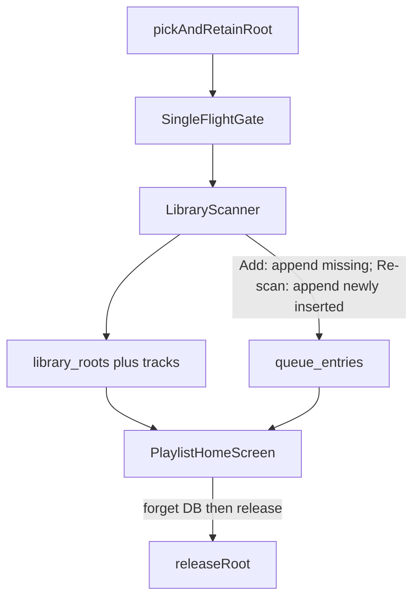

# Phase 2 — Local catalog and single queue

## Locked inputs (roadmap + answers + review)

### Product / UI

- **Catalog vs queue:** Separate Drift entities; queue owns order; tracks do not.
- **Add folder:** Pick+retain SAF root → walk upserts catalog as it goes → **append to queue only after a full successful walk** (partial catalog may remain on failure; no half-queue). On failure/cancel: no queue append for that run; no prune.
- **Re-Add same tree URI:** Refresh the existing root and append all discovered tracks not currently queued (not a second root; no duplicates). This is the explicit refill path after Clear/manual removal.
- **Re-scan queue policy (critical):** Upsert catalog; prune missing only when safe (below); **append only tracks newly inserted into the catalog this run**. Existing catalog tracks the user removed from the queue stay out (no resurrection).
- **Remove / Clear:** Queue only.
- **Forget folder:** Transactionally delete queue rows, tracks, then root **first** → best-effort `releaseRoot` → on release failure `reportError` **without** restoring rows.
- **Home UI (1A):** Queue `ListView`; Add folder; remove row; Clear queue; app-bar overflow for Forget + Re-scan; simple confirms for Clear/Forget. Transport **inert** (Phase 3).
- **Progress:** `Scanning… n` (files processed) or indeterminate — **no** mandatory two-pass total/`n/m`.
- **Cold-start:** No auto re-scan. Open DB + watch queue. Check `hasPersistedAccess` for known roots; **once per revoked root per session** report `library.root.revoked`; keep catalog until forget/successful re-scan.
- **Confirmations:** Clear/Forget in Phase 2 (pulled from Phase 4) — OK, keep minimal.

### Scan safety (critical)

- **Single-flight:** One catalog-mutating op at a time (Add / Re-scan / Forget). UI disables those actions while active. Cancel applies only to the active run.
- **Prune gate:** Mass-delete (`deleteTracksNotIn` + queue prune) only when: walk completed, **not cancelled**, **and every upsert batch succeeded**. Walk “finished” while a batch fails ⇒ **no prune**.
- **Cancel:** Stop scheduling new work; await in-flight materialize; `finally` delete temps; mark incomplete; **never prune**.
- **Channel/list errors mid-walk:** Abort; no prune; `reportError` (`library.scan.failed`).
- **Extensions:** Match audio suffixes on **files only**; **always recurse** directories (do not filter dirs by extension).
- **Tag / oversize materialize:** Per-file: skip tags, still upsert name-only; discard `artworkBytes` immediately (never persist). Listing/walk failures abort prune; tag failures do not.
- **Root displayName:** Decoded last URI segment (best-effort). No new native picker label field in Phase 2.
- **Identity:** `sourceItemId` == `locator` == item `MediaLocator.value` (exact `Uri.toString()`). Root `locator` = tree URI string.
- **Queue uniqueness:** Unique `trackId` on `queue_entries`; append at `MAX(sortIndex)+1`.
- **Message codes (frozen):** `library.scan.started` | `library.scan.complete` | `library.scan.cancelled` | `library.scan.failed` | `library.root.revoked` | `library.forget.complete` | `library.forget.failed` (release failure after DB delete).

### Schema / null columns

- **Artwork:** `artworkCacheRef` nullable — **always null in Phase 2**.
- **`sizeBytes` / `modifiedAt`:** Nullable — **always null in Phase 2** (SAF `listChildren` has no size/mtime; do not extend Kotlin channel now).
- **Audio extensions:** case-insensitive: `.mp3`, `.flac`, `.m4a`, `.aac`, `.ogg`, `.opus`, `.wav`. Non-matches skipped silently.
- **`sourceKind`:** Default `'local'` on roots/tracks; only `local` written in Phase 2 (no further cloud modeling).
- **`playback_state`:** Singleton `id = 1`; columns: `currentQueueEntryId?` (**ON DELETE SET NULL**), `positionMs` default 0, `shuffleEnabled` default false, `repeatMode` default `off`. **Omit** shuffle permutation/history blobs until Phase 4. Enable **`PRAGMA foreign_keys`**. Phase 2 does not drive playback UX from this row.
- **`displayName`:** = `LibraryEntry.name` for files. **Omit `displayPath`** in schema v1.

### Platform / tests / threading

- **Production:** `AndroidLocalLibrarySource` on Android. **Tests / non-Android:** always override with fake `LocalLibrarySource` + in-memory Drift in `pump_app`.
- **Scan threading:** App-isolate async walk + batched DAO writes — intentional KISS. Roadmap “off UI thread” / isolates = **deferred Phase 5 perf**, document as not done.
- **Temp materialize:** Fix `AndroidLocalLibrarySource` temp names with a **random/unique suffix**; keep metadata concurrency **2**.
- **Reuse** Phase 0 contracts; do **not** recreate `CloudLibrarySource`.
- **Out of scope:** Playback / background, Shuffle/Repeat UI, artwork files, iOS, cloud provider, drag-reorder, named playlists, auto cold-start re-scan, broad storage perms, extending SAF list projection, two-pass count, Drift-in-isolate, fat domain/repos, Freezed Drift mirrors, barrel exports, per-track toast spam, `displayPath` column.



---

## Current baseline

- Shell: [`lib/main.dart`](lib/main.dart) prefs + `TinyTunesApp`; home placeholder + inert transport ([`playlist_home_screen.dart`](lib/features/playlist/presentation/playlist_home_screen.dart)).
- Library contracts + Android SAF adapter ready; **no** production Drift DB yet.
- Message/toast pipeline frozen (`reportInfo` / `reportError` + `code`).
- Delete leftover [`lib/spike/`](lib/spike/) (sources **and** generated companions) in Step 0.

---

## Step 0 — Folders + spike cleanup

**Goal:** Durable homes only.

```text
lib/core/database/          # AppDatabase + tables
lib/features/library/
  application/              # LibraryScanner / single-flight ingest controller
lib/features/playlist/
  application/              # queue clear/remove if not on scanner
  presentation/             # already exists
```

**Rules:** No barrel exports; no empty `domain/` or fat repos on top of thin DAOs. Delete `lib/spike/` entirely (including `*.g.dart` / `*.freezed.dart`).

**Exit:** Tree ready; analyze green.

---

## Step 1 — Drift schema v1 + DB bootstrap

**Goal:** Persistent catalog/queue; FK-safe playback pointer.

**Tables:**

| Table | Columns (KISS) |
| --- | --- |
| `library_roots` | `id`, `locator` (unique text), `displayName`, `sourceKind` default `local`, `addedAt` |
| `tracks` | `id`, `rootId` FK cascade, `sourceItemId`, `locator` (same value as sourceItemId in P2), `displayName` only (**no `displayPath`**), `sizeBytes?` / `modifiedAt?` / `artworkCacheRef?` (**always null P2**), `title?`, `artist?`, `album?`, `sourceKind` default `local`; unique `(rootId, sourceItemId)` |
| `queue_entries` | `id`, `trackId` FK (**unique**), `sortIndex`; on track delete cascade/prune entries |
| `playback_state` | singleton `id=1`; `currentQueueEntryId` FK → `queue_entries.id` **ON DELETE SET NULL**; `positionMs`, `shuffleEnabled`, `repeatMode` — **no** shuffle blobs |

**Bootstrap:**

- Open via `drift_flutter` under app documents; **`PRAGMA foreign_keys = ON`**.
- `appDatabaseProvider` keepAlive; seed `playback_state` id=1 if missing.
- [`pump_app.dart`](test/helpers/pump_app.dart): in-memory DB + fake library source overrides.

**Exit:** Codegen OK; unit test opens DB + asserts singleton + FK SET NULL on queue delete.

---

## Step 2 — DAOs (thin, no UI)

**Goal:** Write/read API for scanner and home — DAOs only, not a second repository layer.

- Roots: `upsertRoot`, `watchRoots`, `getByLocator`, `deleteRootCascade` (DB only; caller releases grant after).
- Tracks: `upsertTracksBatch` (returns which ids were **newly inserted** vs updated), `deleteTracksNotIn(rootId, seenSourceItemIds)`, getters.
- Queue: `appendTrackIds` (skip existing `trackId`; `MAX(sortIndex)+1`), `removeEntry`, `clearAll`, `watchOrderedQueue` (join tags/names), prune with track deletes.
- No `BuildContext` / toasts in DAOs.

**Exit:** In-memory tests: unique queue trackId; clear leaves catalog; cascade forget; prune only when caller invokes delete-not-in; `currentQueueEntryId` nulls on entry delete.

---

## Step 3 — Library scanner (single-flight ingest)

**Goal:** One `LibraryIngestController` / scanner notifier — mutates catalog/queue safely.

**Single-flight:** Mutex/flag; reject or no-op overlapping Add/Re-scan/Forget; UI disables those controls.

**Flow — Add folder:**

1. Acquire single-flight; `reportInfo` `library.scan.started`.
2. `pickAndRetainRoot()` → null = cancel (no error); release flight.
3. If locator already exists → refresh that root, prune only when safe, then append every discovered track missing from the queue; skip duplicate root insert.
4. Else insert root (`displayName` = decoded last URI segment).
5. Walk: recurse **all** dirs; audio **files** only by extension; progress `n`++; metadata concurrency **2** with **unique temp suffixes**; discard artwork bytes; batch upsert catalog (partial catalog OK on later failure).
6. **Queue append only after full successful walk** of this add (all batches OK, not cancelled). Mid-failure: keep partial catalog; **do not** append queue; **do not** prune.
7. Success → append all tracks discovered this run that are not already queued → `library.scan.complete`; cancel → `library.scan.cancelled`; failure → `library.scan.failed`.

**Flow — Re-scan (per selected root):**

1. Single-flight; `hasPersistedAccess` false → `library.root.revoked`, abort, no prune.
2. Walk + batch upsert; collect `seenSourceItemIds` + **newly inserted** track ids.
3. Prune **only** if walk complete ∧ not cancelled ∧ all batches OK → `deleteTracksNotIn` + queue prune.
4. Append to queue **only newly inserted** track ids (never resurrect user-removed rows).
5. Message codes as frozen list.

**Forget:**

1. Single-flight; confirm in UI.
2. In one DB transaction, explicitly delete related queue rows, tracks, then root.
3. Best-effort `releaseRoot`; failure → `library.forget.failed` (rows stay deleted).
4. Success → `library.forget.complete`.

**Providers:** Android adapter in production; tests override fake + reader.

**Exit:** Fake-source tests cover: nested add; add mid-fail keeps catalog / no queue; re-add same locator refills without duplicates; explicit re-scan does not resurrect; incomplete/cancel/batch-fail no prune; complete prune removes missing; single-flight rejects overlap; forget DB-then-release order.

---

## Step 4 — Playlist home UI + actions

**Goal:** Real queue chrome; no audio.

- `ListView`: title = tag title or `displayName`; subtitle = artist; empty state.
- Add folder control; row remove (trailing or `Dismissible`).
- Overflow: Clear (confirm), Re-scan (pick root), Forget (pick root + confirm).
- While single-flight active: disable Add / Re-scan / Forget; show banner `Scanning… n` (or indeterminate) + Cancel.
- Transport stays inert.
- ARB en + de for all new strings (including message texts passed into `report*`).

**Exit:** Widget tests via `pump_app` (in-memory DB + fake source): empty → seed → remove → clear; actions disabled during fake long scan.

---

## Step 5 — Docs, CONTEXT, changelog, exit gate

- [`docs/features/library-ingest.md`](docs/features/library-ingest.md): catalog vs queue; single-flight; re-scan append-new-only; prune gate; forget ordering; null columns; progress `n`; app-isolate scan + Phase 5 isolate note; message codes.
- Update [`docs/features/README.md`](docs/features/README.md) + [`docs/CHANGELOG.md`](docs/CHANGELOG.md).
- Root [`CONTEXT.md`](CONTEXT.md) glossary: catalog, queue, library root, forget folder, MediaLocator, queue entry vs track, sourceItemId, Winamp queue, single-flight scan.

**Final gate:**

```text
flutter gen-l10n
dart run build_runner build --delete-conflicting-outputs
flutter analyze
flutter test
```

**Device:** Add nested folder → kill/reopen persists → explicit re-scan idempotent + no resurrection after manual remove → Add same folder refills missing rows without duplicates → Clear → Add refills → Forget → Add refills → revoke reports without crashing.

**Exit checklist**

- [x] Schema v1 + FK SET NULL; null `artworkCacheRef`/`sizeBytes`/`modifiedAt`; no `displayPath`
- [x] Single-flight; prune only after full walk + all batches + not cancelled
- [x] Re-Add same locator refills missing queue rows without duplicates; explicit re-scan appends only newly inserted catalog tracks
- [x] Add-folder: queue append only after full successful walk; unique temps + concurrency 2
- [x] Files-only extension match; recurse dirs; `Scanning… n`
- [x] Forget: transactionally delete queue/tracks/root, then `releaseRoot`
- [x] Home chrome complete; transport inert
- [x] Docs + CONTEXT + CHANGELOG; spike gone; tests + device proof (manual gate passed 2026-07-19)

---

## Implementation handoff

- **Add folder is the refill command:** a new root appends all discovered
  tracks; an existing root is refreshed and every discovered track not already
  queued is appended. Queue uniqueness prevents duplicates.
- **Re-scan is catalog synchronization:** it appends only catalog rows created
  during that scan, so manually removed queue rows remain removed.
- **Clear is queue-only:** use Add folder to refill from the retained catalog.
- **Forget is explicit and transactional:** delete related queue rows, tracks,
  then the root; release the SAF grant afterward. A later Add is a fresh import.
- **Native plugin changes require a full rebuild:** hot reload cannot update
  `SafLibraryPlugin.kt`. Startup persisted-access checks catch channel failures
  so stale native code does not produce an unhandled exception.
- **Metadata decoding is best-effort:** malformed tags produce a name-only
  catalog row and do not fail the scan.

---

## Explicitly reject (YAGNI)

- Extending Kotlin `listChildren` for size/mtime
- Two-pass count-then-scan; Drift/worker isolates for DAO
- Fat `domain/` + repos; barrel exports; Freezed mirrors of Drift rows
- Shuffle helper columns; artwork cache writes; auto cold-start re-scan
- Drag-reorder; named playlists; per-track toast spam
- Cloud modeling beyond `sourceKind = local`

## Suggested commit rhythm (when you ask to commit)

1. Spike delete + schema + DB bootstrap + DAO tests
2. Scanner + single-flight + fake-source tests
3. Home UI + widget tests + ARB
4. Docs + CONTEXT + CHANGELOG + exit polish
