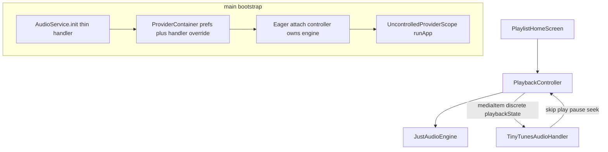

# Phase 3 — Playback + background (one vertical slice)

## Locked decisions (roadmap + both feedback passes)


| Topic                                   | Decision                                                                                                                                                                                                                                           |
| --------------------------------------- | -------------------------------------------------------------------------------------------------------------------------------------------------------------------------------------------------------------------------------------------------- |
| Background stack                        | `just_audio` + **direct** `audio_service` (promote current transitive `0.18.x`, pin explicitly). **Remove** `just_audio_background`. No `JustAudioBackground.init`.                                                                                |
| Bootstrap                               | **Fixed sequence** (no open pattern): see Step 0. Pre-attach OS intents → **no-op**. Tests attach without `AudioService.init`.                                                                                                                     |
| Source model                            | One track at a time via `AudioSource.uri`. Notification skip → handler → controller.                                                                                                                                                               |
| Identity                                | Drift/UI = `queueEntryId`; `MediaItem.id` = `**trackId**` (queue uniqueness today; document).                                                                                                                                                      |
| Navigation                              | Hardcode **Off/Off** until Phase 4.                                                                                                                                                                                                                |
| Prev                                    | **3s rule**; no wrap past first.                                                                                                                                                                                                                   |
| Complete at last                        | Keep entry id, position ≈ end, **paused**.                                                                                                                                                                                                         |
| Row tap on current                      | **Toggle** play/pause.                                                                                                                                                                                                                             |
| Remove current (or forget multi-delete) | Shared skip with `**AdvanceReason.currentRemoved**` → advance and **autoplay** next. Successor = first id in **old suffix** (from vanished entry onward in pre-mutation order) that still exists in **new** snapshot — not “next sortIndex” alone. |
| Clear queue                             | **Stop** + `checkpoint(entryId: null, positionMs: 0)` — no autoplay.                                                                                                                                                                               |
| Missing / load fail                     | `player.file.missing` vs `player.load.failed`; then `AdvanceReason.unplayable` with **autoplay**; consecutive bound **N = 5**.                                                                                                                     |
| Complete → next                         | `AdvanceReason.completed` → autoplay next (or complete@last keep+paused).                                                                                                                                                                          |
| Manual Next                             | `AdvanceReason.manualNext` (handler/UI).                                                                                                                                                                                                           |
| Cold start                              | Restore paused; **once-flag**; invoke from `**PlaybackController.build()` / first attach** after first queue+DAO read. Never home post-frame.                                                                                                      |
| Serialized loads                        | **Generation counter only** (no intent queue). Guard engine **stream** callbacks with the same generation (stale `completed` must not advance the new track).                                                                                      |
| Phase 4 seam                            | `advanceAfterCurrentGone({required AdvanceReason reason})` with `completed` / `manualNext` / `currentRemoved` / `unplayable`. Handler stays thin forever.                                                                                          |
| Session owner                           | **Controller after attach** configures `audio_session` once; noisy + interrupt → pause + checkpoint; **no auto-resume**.                                                                                                                           |
| Checkpoint flush                        | Throttle ~2s while playing; also flush on pause/stop/seek/noisy/interrupt and on `**AppLifecycleState.paused` / `detached**`.                                                                                                                      |
| Handler `playbackState`                 | Push on **discrete** events only (play/pause/skip/load/seek-end) — not every position tick.                                                                                                                                                        |
| Background l10n                         | `MessageReporter` from background paths uses english/fallback mapper (same pattern as library ingest).                                                                                                                                             |
| Eager restore vs toasts                 | Restore **load** stays in controller. Until `ToastificationWrapper` mounts: session store + english mapper only, **or** defer toast side (not the load) until after first frame. Never move restore to home.                                         |
| Commit after load                       | Update in-memory current / `MediaItem` / checkpoint **only after successful `setUri`**. Failed candidate keeps prior current until `unplayable` advance.                                                                                           |
| Handler in DI                           | After `AudioService.init`, override `audioHandlerProvider` with the returned handler — attach via container, not a hidden singleton.                                                                                                               |
| Activity class                          | One README story: `AudioServiceActivity` **or** subclass current `MainActivity` from it — pick in Step 0, verify on device in Step 6.                                                                                                              |
| Transport UI                            | Seek bar + position/duration + highlight; no cover art.                                                                                                                                                                                            |





---

## Why drop `just_audio_background`

Custom `BaseAudioHandler` is required for lock-screen Next/Prev now and Phase 4 matrix later. `just_audio_background` only wraps the simple case and conflicts with `AudioService.init`. Keep `just_audio` + `audio_session` + direct `audio_service`.

---

## What already exists (reuse)

- `[CatalogDao](lib/core/database/catalog_dao.dart)`, `[orderedQueueProvider](lib/features/playlist/application/playlist_providers.dart)`, `[QueueTrackView](lib/core/database/catalog_dao.dart)`
- Reserved `[PlaybackState](lib/core/database/tables.dart)` — no migration
- `[LocalLibrarySource.resolvePlaybackUri](lib/core/library/local_library_source.dart)`
- `[_InertTransportChrome](lib/features/playlist/presentation/playlist_home_screen.dart)`
- `[MessageReporter](lib/core/messages/message_reporter.dart)`

## Out of scope

- Shuffle / Repeat UI and matrix body (Phase 4) — seam via `AdvanceReason` only
- Artwork, isolates/scan perf, iOS library parity, cloud, drag-reorder, named playlists, Settings theme picker

---

## Step 0 — Platform + bootstrap (locked sequence)

**Goal:** No chicken-egg; no later manifest rewrite.

1. **Deps:** Promote/pin direct `audio_service` (compatible with current `just_audio`; today transitive `0.18.18`/`0.18.19` via background). **Remove** `just_audio_background`. Keep `just_audio` + `audio_session`.
2. **`main()` bootstrap (exact order):**
  1. `WidgetsFlutterBinding.ensureInitialized` + sqlite workaround
  2. `AudioService.init(...)` → returns **thin** `TinyTunesAudioHandler` with **no `AudioPlayer`**; OS intents before attach → **no-op**
  3. Load prefs; create `ProviderContainer` with prefs + **`audioHandlerProvider.overrideWithValue(handler)`** (attach is DI, not a hidden singleton)
  4. Eager-read keepAlive `PlaybackController` so it **attaches** via that provider and **owns the single engine**; controller becomes session owner (configure music `AudioSession`, subscribe noisy/interrupt)
  5. `runApp(UncontrolledProviderScope(container: ..., child: TinyTunesApp()))`
3. **Android** [`AndroidManifest.xml`](android/app/src/main/AndroidManifest.xml):
  - `WAKE_LOCK`, `FOREGROUND_SERVICE`, `FOREGROUND_SERVICE_MEDIA_PLAYBACK`
  - **Activity (pick one story in this step):** use `com.ryanheise.audioservice.AudioServiceActivity` **or** change `MainActivity` to extend `AudioServiceActivity` / `AudioServiceFragmentActivity` per package README — document the choice; verify on device in Step 6
  - `AudioService` + `mediaPlayback` FGS + browse intent-filter
  - `MediaButtonReceiver` + media-button filter; `exported` as required
  - **No** broad storage permissions (ADR 0001)
4. **iOS** `[Info.plist](ios/Runner/Info.plist)`: `UIBackgroundModes` → `audio`
5. Notification icon: launcher / simple monochrome if required

**Exit:** App launches; pre-attach media buttons no-op safely; after attach, noisy/interrupt owned by controller.

---

## Step 1 — Playback persistence DAO

Extend `[CatalogDao](lib/core/database/catalog_dao.dart)`:

- `watchPlaybackState()` / `getPlaybackState()`
- Atomic `checkpoint({int? entryId, required int positionMs})`

Ignore shuffle/repeat columns. Tests: seed, checkpoint, FK SET NULL as side effect.

---

## Step 2 — Engine + thin handler

```
lib/features/player/
  application/
    playback_engine.dart
    just_audio_playback_engine.dart
    tinytunes_audio_handler.dart
    playback_controller.dart
    player_providers.dart
    player_message_codes.dart
    player_l10n_mapper.dart
  presentation/
    transport_chrome.dart
```

- `**PlaybackEngine`:** `setUri` / play / pause / seek / stop + streams; fakeable
- `**JustAudioPlaybackEngine`:** single `AudioPlayer`; `MediaItem.id = trackId.toString()`; no artUri
- `**TinyTunesAudioHandler`:** attach API for controller; before attach all remote commands no-op; after attach delegate play/pause/seek/stop/skipToNext/skipToPrevious to controller; never owns the player; never implements Phase 4 matrix
- Controller pushes `mediaItem` + `playbackState` on **discrete** events only

**Acceptance:** Lock-screen Next/Prev hit controller (device check in Step 6).

---

## Step 3 — `PlaybackController`

`@Riverpod(keepAlive: true)` — pattern like `LibraryIngestController`.

UI state: `currentQueueEntryId`, `playing`, `position`, `duration`.

### Generation guard

- Increment generation on every load/skip intent
- Ignore engine stream events (esp. `completed`) whose generation ≠ current

### `restoreOnLaunch`

- Once-flag; called from **`build()` / first attach** after first successful queue + playback_state read
- Load + seek `positionMs`, stay paused; else optional `player.restore.skipped`
- **Toasts before UI:** if restore runs before `ToastificationWrapper` mounts, write session messages with english/fallback mapper only, **or** defer toast delivery until after first frame — keep load ownership in the controller

### Commit after successful `setUri`

- On play/restore/skip load: attempt resolve + `setUri` first
- **Only on success** update in-memory `currentQueueEntryId`, push `MediaItem`, and `checkpoint`
- On failure keep prior current until `advanceAfterCurrentGone(unplayable)`

### Off/Off + mutation edges


| Event                                   | Behavior                                                                                               |
| --------------------------------------- | ------------------------------------------------------------------------------------------------------ |
| Complete (not last)                     | `advanceAfterCurrentGone(completed)` → **autoplay** next                                               |
| Complete (last)                         | Pause; keep id; position ≈ end; checkpoint                                                             |
| Next at last                            | No-op                                                                                                  |
| Prev                                    | 3s rule; no wrap                                                                                       |
| Remove current / forget deletes current | Successor from **old suffix ∩ new snapshot**; `advanceAfterCurrentGone(currentRemoved)` → **autoplay** |
| Clear queue                             | Stop; clear checkpoint; **no** autoplay                                                                |
| Empty after stop                        | `checkpoint(null, 0)`                                                                                  |
| Unplayable                              | Report code; `advanceAfterCurrentGone(unplayable)` → autoplay; stop after **N = 5** consecutive        |


### `advanceAfterCurrentGone({required AdvanceReason reason})`

Single path for `completed` / `manualNext` / `currentRemoved` / `unplayable`. Phase 4 swaps nav policy behind this; handler unchanged.

**Deletion / FK:** in-memory current + pre/post queue snapshots; Drift SET NULL is not the skip signal.

### Persistence + lifecycle

- Checkpoint on track change, pause, seek, noisy/interrupt
- Throttle position ~2s while playing
- Flush on `AppLifecycleState.paused` / `detached` (WidgetsBinding observer on controller or tiny binder)

### Session (controller after attach)

- Configure music session once
- Noisy → pause + checkpoint
- Interrupt → pause + checkpoint; no auto-resume
- Background reports: english/fallback l10n mapper

---

## Step 4 — Home UI

1. `TransportChrome` replaces inert chrome (seek bar + buttons)
2. Row tap → `playEntry` (toggle if current)
3. Highlight via `ColorScheme`
4. **No** home `restoreOnLaunch`
5. ARB for player errors; reuse/extend `transport*` tooltips

---

## Step 5 — Tests


| Test                     | Focus                                                                                                                                                                                  |
| ------------------------ | -------------------------------------------------------------------------------------------------------------------------------------------------------------------------------------- |
| DAO                      | checkpoint; SET NULL side effect                                                                                                                                                       |
| Controller + fake engine | Off/Off, 3s prev, complete@last, toggle-if-current, remove→**autoplay** via live queue, clear→stop, N=5, restore once from build, generation ignores stale completed, suffix successor |
| Widget (optional)        | highlight + tap                                                                                                                                                                        |


**Harness:** fake engine by default in `[pump_app.dart](test/helpers/pump_app.dart)`; **no** `AudioService.init` in tests; `liveQueueStreams: true` for remove→skip; no real audio/FGS in CI.

---

## Step 6 — Docs, version, device exit

1. `[docs/features/player.md](docs/features/player.md)` — bootstrap, handler attach, Off/Off, `AdvanceReason`, skip/autoplay vs clear, session policy, identity split, deps
2. Update README, library-ingest (transport live), CHANGELOG, CONTEXT if needed; note ADR/player doc: `audio_service` not `just_audio_background`
3. Version **0.4.0**; `///` + l10n in-phase
4. **Device exit** (Nothing A065): foreground+seek; lock-screen Next/Prev; chosen activity class; noisy→pause; interrupt→pause; kill→restore paused; missing→toast+skip; remove current→**autoplay** next; clear→stop

**Exit criteria:** Foreground + background, notification skip, interruptions/noisy, process recreation pass on physical Android.

---

## Implementer notes (not architecture blockers)

- Handler lives in the container via `audioHandlerProvider` override after init.
- Eager restore must not crash or drop messages because toasts are not mounted yet — session-first or defer toast side only.
- Activity: one README-aligned story; Step 6 device-proves it.
- Never commit current/MediaItem/checkpoint on a failed `setUri` candidate.

## Implementation order

**0 → 1 → 2 → 3 → 4 → 5 → 6.** One engine, thin handler, generation guard, one `advanceAfterCurrentGone(AdvanceReason)`, atomic checkpoint. No shuffle storage, no artwork, no sequence API.