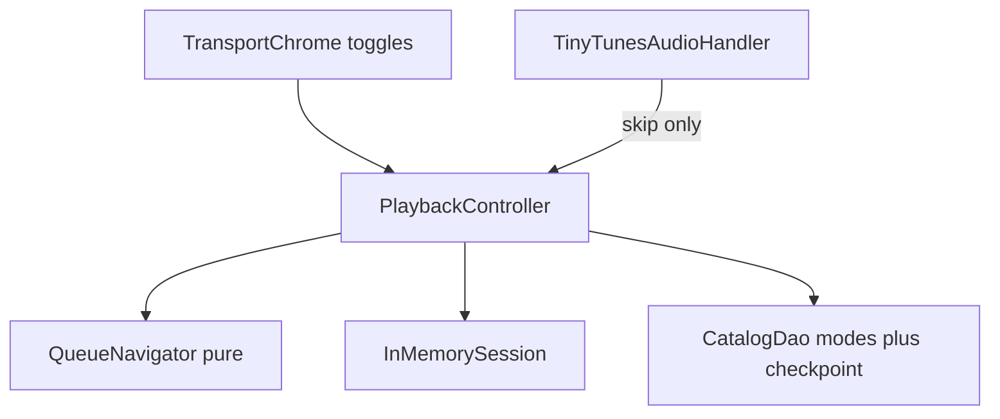

# Phase 4 — Shuffle × Repeat (KISS, hardened)

## Locked product decisions

Confirmed after feedback pass (all six clarifications accepted).

| Topic | Decision |
| --- | --- |
| Matrix | Roadmap 6 combos ([Playback modes](.cursor/plans/tinytunes_roadmap_d322b16d.plan.md)) |
| Shuffle ON (from Off) / row tap (**Shuffle+Off only**) | Keep (or tap) track as head; shuffle **remaining** after it |
| Shuffle+One / Shuffle+All session | **History only** — no permutation; Next = random; Previous = pop history |
| Enter Shuffle+All or Shuffle+One | Always start with **empty** history |
| Row tap under One/All | Play tapped; push prior current to history when leaving; **no** perm rebuild |
| Off/All + `currentRemoved` empty suffix | Wrap to **first** of new queue |
| No successor (remove/unplayable) | Stop + clear now-playing; **keep modes** |
| Cold start | Persist **modes only**; rebuild fresh perm (Off) / empty history (One/All). Intentional roadmap deviation: order/history do **not** survive process death |
| Queue list UI | Always **canonical** `sortIndex` |
| Remove track | No confirm |
| Drag-reorder | Out of scope |
| Stack | `audio_service` + thin handler (roadmap `just_audio_background` text is stale) |
| `stopAtEnd` | Preserve Phase 3: **pause at end, keep current, checkpoint** — never clear now-playing |
| Modes vs idle | Modes are preferences — survive clear / stop / `_clearNowPlaying`; `idle` must not wipe toggles |
| Session commit | Commit proposed session only after successful `setUri`; unplayable advances separately |
| Random in tests | `Provider<Random>` override — not notifier ctor inject |
| Mode persistence tests | In-memory `AppDatabase` + `getPlaybackState()` — no fake DAO seam |
| Toggles enablement | Shuffle/Repeat **always enabled** (roadmap “no greying”); Prev/Play/Next stay `hasCurrent`-gated |
| Invalid `repeatMode` in DB | Codec fallback → `off` |

## Architecture (minimal)

Reuse Phase 3 seams. **No** Drift permutation/history columns (schema stays v1; `shuffleEnabled` / `repeatMode` already exist).

- **`QueueNavigator`** (pure Dart, unit-tested): modes + queue ids + session + current + reason → `NavigationAction` (`play`, `seekZero`, `stopAtEnd`, `noop`) **plus proposed next session** (commit only after successful load).
- **`ShuffleSession`** (in-memory on controller):
  - **Shuffle+Off:** `permutation` + `index`
  - **Shuffle+All / Shuffle+One:** `history` only (no perm)
  - Never persisted
- **Canonical queue** stays `List<QueueTrackView>` from Drift.

## Controller seam contract (lock before Step 3)

Mandatory — these are the paths that would otherwise silently keep Off/Off:

1. **`_onQueueChanged`:** After updating `_queue`, **always** sync session (prune removed ids from perm/history; append new ids to end of perm when Shuffle+Off). **Then** branch empty-queue / remove-current. Never early-return before session sync when current is still present.
2. **`currentRemoved` / `unplayable`:** Always through navigator (Off policy may still be suffix / `_nextAfter`). Navigate from an **old-session snapshot**, then prune — do not prune the cursor away before choosing the successor.
3. **Shuffle+One = history + random Next;** no permutation. Row-tap rebuild applies only to **Shuffle+Off** (and turning Shuffle ON while Repeat is Off).
4. **Modes survive** clear/stop/idle; restore applies modes with or without a current track.
5. **Commit session after successful `setUri`**; unplayable advances with a separate failed-candidate path (never re-pick the failed id).
6. **Exit criteria:** toggles + checkpoint survive process death; shuffle order/history intentionally reset.

### Navigator extension — `currentRemoved` / `unplayable`

| Reason | Off/* | Shuffle+Off | Shuffle+All / One |
| --- | --- | --- | --- |
| `currentRemoved` | Off/Off: Phase 3 suffix; Off/All: wrap to first if suffix null; Off/One: play suffix (cannot loop removed) | next after removed slot in **old** perm, then prune | random from remaining (excl. vanished) |
| `unplayable` | same as Next from failed id | next in perm / never re-pick failed | random excl. failed |

**No successor** (any mode): stop engine + clear now-playing fields + checkpoint null — **keep modes**.

### Mode transitions (Shuffle On)

| From → To | Session effect |
| --- | --- |
| → Shuffle Off | Clear perm + history; navigate canonical thereafter |
| → Shuffle On + Repeat Off | `rebuildFromHead(current)` (or full shuffle of queue if no current) |
| → Shuffle On + Repeat All | Clear perm; **empty** history |
| → Shuffle On + Repeat One | Clear perm; history-only (keep or empty history — **empty** on enter) |
| Off ↔ All ↔ One while Shuffle On | All clears perm + empty history; leaving All rebuilds perm **only** if entering Off; entering One → history-only, clear perm |

### Row tap

| Mode | Behavior |
| --- | --- |
| Shuffle Off | Play tapped (canonical); no session rebuild |
| Shuffle+Off | Play tapped; **rebuild** perm = `[tapped] + shuffle(rest)` |
| Shuffle+All / One | Play tapped; push prior current onto history when leaving a track; **no** perm |

## Step 0 — Domain types (no UI yet)

Under [`lib/features/player/application/`](lib/features/player/application/):

- `RepeatMode { off, one, all }` with `cycle()` + string codec (`off`/`one`/`all`); invalid → `off`.
- `ShuffleSession` + `rebuildFromHead(headId, queueIds, Random)` used **only** for Shuffle+Off.
- `NavigationAction` including proposed next session fields.

## Step 1 — Persist modes only (DAO)

Extend [`CatalogDao`](lib/core/database/catalog_dao.dart):

- `updatePlaybackModes({required bool shuffleEnabled, required String repeatMode})` — writes **only** those two columns (must not touch entry/position).
- Keep `checkpoint` as entry/position only.

**Restore sequence** in `_restoreOnLaunch` (replaces early-return-when-null that skips UI modes):

1. Load queue  
2. `getPlaybackState()` (modes + checkpoint)  
3. Apply modes to controller + `PlaybackUiState`  
4. Rebuild/clear session per locked rules (Shuffle+Off → fresh perm from current head if present; One/All → empty history)  
5. If entry still exists → load **paused**; if missing → clear entry/position only — **keep modes**

Serialize mode writes from latest controller snapshot (simple in-flight flag / generation) so rapid shuffle+repeat taps cannot persist a stale pair.

## Step 2 — Pure `QueueNavigator` (matrix core)

New file e.g. [`queue_navigator.dart`](lib/features/player/application/queue_navigator.dart).

| Shuffle | Repeat | Complete | Next | Previous (after 3s rule) |
| --- | --- | --- | --- | --- |
| Off | Off | next canonical / stopAtEnd@last | same; no-op@last | prev canonical; seek0@first |
| Off | All | next; wrap to first | same | prev; wrap to last |
| Off | One | seekZero + replay | advance canonical then loop | prev canonical then loop |
| On | Off | next in perm / stopAtEnd@last | same; no-op@last | prev in perm; seek0@first |
| On | All | random excl. current if `len>1`; push history | same | pop history; else seek0 |
| On | One | seekZero + replay | random excl. current if `len>1`; push history; then loop | pop history; else seek0; then loop |

Plus `currentRemoved` / `unplayable` rows from the seam contract above.

**Random:** uniform among candidates excluding current/failed when `length > 1`; sole track may re-pick itself.

Controller owns the 3s Previous threshold; navigator decides *which* entry after seek-0 short-circuit.

**Repeat One complete:** controller uses seek+play on the **same** load — not `_loadAndPlay` (avoids generation / MediaItem churn).

## Step 3 — Swap controller policy

In [`playback_controller.dart`](lib/features/player/application/playback_controller.dart):

- Hold `_shuffleEnabled`, `_repeatMode`, `_session`; `Random` via `Provider<Random>` (override in tests — not ctor inject on `@riverpod` notifier).
- Route complete / next / previous / `currentRemoved` / `unplayable` through navigator; commit proposed session **only after** successful `setUri`.
- Implement seam contract item 1 for `_onQueueChanged` (fix today’s early `if (stillThere) return` before session sync).
- `setShuffleEnabled` / `cycleRepeatMode` → memory → serialized `updatePlaybackModes` → session transition table.
- Extend [`PlaybackUiState`](lib/features/player/application/playback_ui_state.dart) with modes; `_clearNowPlaying` clears now-playing fields **only** (preserve modes).
- Update stale Off/Off `///` docs on controller/handler.
- Handler stays thin — no matrix in [`tinytunes_audio_handler.dart`](lib/features/player/application/tinytunes_audio_handler.dart).

## Step 4 — Transport UI + l10n

[`transport_chrome.dart`](lib/features/player/presentation/transport_chrome.dart):

- Layout: **Shuffle | Prev | Play/Pause | Next | Repeat** (`spaceEvenly`).
- Shuffle/Repeat always enabled; use `IconButton.isSelected` + `ColorScheme.primary`.
- Off vs All both use `Icons.repeat` — differentiate with **color + tooltips** (`en` + `de` ARB).
- One uses `Icons.repeat_one`.

No Settings entries.

## Step 5 — Queue polish

- Clear/forget confirms already exist — no change.
- Every queue mutation path hits session prune/append (Add folder / re-scan append → end of perm when Shuffle+Off).
- Home list remains canonical.

## Step 6 — Tests

**Navigator** (`queue_navigator_test.dart`): table for all 6 combos × complete/next/prev; `currentRemoved`/`unplayable`; wrap; stopAtEnd; Repeat One seekZero; history pop; seeded `Random`; single-track + empty queue.

**Controller** (`playback_controller_test.dart`, in-memory `AppDatabase` — assert via `getPlaybackState()`, no fake DAO seam):

1. `_onQueueChanged` prune when removing **non-current**; append extends perm (Shuffle+Off)
2. Remove current under Shuffle+Off uses **perm successor**, not suffix
3. `unplayable` under Shuffle On ≠ canonical `_nextAfter` (seeded `Random`)
4. Clear / remote stop **preserves** modes in UI + Drift
5. Restore with null/missing current still shows modes
6. Repeat One complete: no new `setUri`, seek0 + play
7. Single-track + empty queue smoke for modes
8. Mode cycle All → Off rebuilds perm from current
9. `updatePlaybackModes` does not touch entry/position
10. Existing Off/Off regression stays green

No `AudioService.init` in tests.

## Step 7 — Docs + exit

- Update [`docs/features/player.md`](docs/features/player.md): full matrix, session model (Off=perm, One/All=history), modes in Drift, intentional **no** order persistence, transport toggles, row-tap rules, seam behavior for remove/unplayable.
- [`docs/CHANGELOG.md`](docs/CHANGELOG.md) under Unreleased with **0.5.0** as version **intent** (not a release operation).
- Roadmap Phase 4 exit wording: *toggles + checkpoint survive process death; shuffle order/history intentionally reset* — so modes-only is not read as a miss.
- Update stale Off/Off comments; mark Phase 4 todo when implementing.
- Exit: analyze + tests green; Android smoke of all 6 combos + process death restores **toggles** (order may differ — expected).

## Out of scope

- Drift permutation/seed/history blobs
- Drag-reorder, named playlists, artwork
- Remove-track confirmation
- Phase 5 Settings / hardening polish

## Implementation order

`0 types → 1 DAO modes → 2 pure navigator + tests → 3 controller seam contract → 4 UI/l10n → 5 queue prune sanity → 6 controller tests → 7 docs/changelog`

Navigator-first keeps the matrix correct before UI noise.
