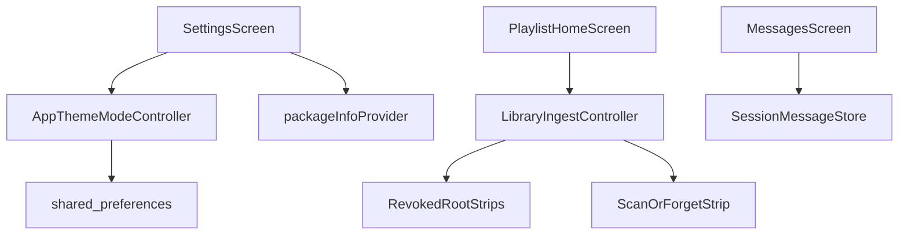

# Phase 5 — Android daily-driver hardening (KISS)

Review consensus: **approve-with-fixes**. The four must-fixes below are implementation constraints, not optional polish.

## Locked product decisions

| Topic | Decision |
| --- | --- |
| Scan isolates | **Measure-first** — keep app-isolate scan; large-library device smoke only; isolates only as a later follow-up if jank is proven |
| Settings | Theme mode (System / Light / Dark) + **About** (app name + `version` only); no scheme picker; no in-app language picker |
| Locale | System locale; explicit callback → **English** when OS locale is not `en`/`de` (generated `supportedLocales` is `[de, en]` — do **not** trust order) |
| Empty queue | Title **“Queue is empty.”** + button **“Add folder”** (no duplicated “Add a folder” wording) |
| Revoked roots | Persistent home strip(s); toast/message still OK; **Forget primary only** (Add stays on app bar) |
| Revoked state seam | On **`LibraryIngestController` / ingest state** (not a sibling provider) |
| Revoke recheck | **Cold-start / explicit check paths only** (KISS); document — no live grant watcher while app is open |
| Unplayable | Keep toast + auto-advance + skip-bound; **no** per-row broken chrome |
| Message filters / clear-all | Out of scope |
| Artwork / schema v2 | Out of scope (`artworkCacheRef` stays null/unused; no migration suite) |
| Message demo | Remove in **Step 5** (not deferred to Step 8) |
| Message list UI | Show human-readable `message` only; codes stay in the model, not the subtitle |
| Folder dismiss | Must exit Add-folder SAF pick and in-app root picker without choosing a folder |
| Queue actions | Stay on home (unchanged) |
| Version bump | **`0.6.0+6`** (not bare `0.6.0`) |
| `package_info` tests | Overrideable Riverpod **`packageInfoProvider`** |
| Theme radios | Analyzer-clean control for this Flutter SDK (`RadioGroup` / equivalent if `RadioListTile` is deprecated) |
| `file_picker` / `permission_handler` | Keep deps; do **not** expand Step 8 into unused-dep purge |

## Architecture (minimal — reuse existing seams)

No new Drift tables. Theme write path already exists in [`lib/core/theme/theme_providers.dart`](lib/core/theme/theme_providers.dart). Settings only wires UI.

**Home banner chrome:** Reuse the existing custom `Material` strip on playlist home (not `MaterialBanner`). Stack order: **revoked strips above** scan/forget progress strip.

---

## Step 0 — Locale English fallback

In [`lib/main.dart`](lib/main.dart) `MaterialApp.router`, add an explicit `localeListResolutionCallback` that:

1. Picks an exact / language-code match for `de` or `en` from the preferred locales.
2. Otherwise returns `Locale('en')`.

**Do not** rely on generated `AppLocalizations.supportedLocales` order (it is `[de, en]` today — without a callback, unsupported locales fall back to **German**).

No prefs key, no Settings language control.

**Tests:** unsupported locale (e.g. `fr`) resolves to English app strings.

---

## Step 1 — Settings: theme mode + About

Replace the stub in [`lib/features/settings/presentation/settings_screen.dart`](lib/features/settings/presentation/settings_screen.dart):

- **Appearance:** System / Light / Dark → `appThemeModeControllerProvider.notifier.setMode(...)`. Use analyzer-clean radio pattern for this SDK.
- **About:** app title + **`version` only** via `package_info_plus`. Add dependency + **`packageInfoProvider`** (async/`FutureProvider` or sync after bootstrap) so widget tests override without a live platform channel.

Remove stub copy (`settingsStubBody`). en+de ARB for section labels / About strings.

**Tests:** Settings widget test — tapping Light updates provider / prefs; override `sharedPreferencesProvider` + `packageInfoProvider`.

**Docs:** Update [`docs/features/theming.md`](docs/features/theming.md); README index note only if needed — no dedicated settings feature doc required (KISS).

---

## Step 2 — Empty queue CTA

In [`playlist_home_screen.dart`](lib/features/playlist/presentation/playlist_home_screen.dart) empty branch:

- Title: **“Queue is empty.”** (ARB; adjust `queueEmpty` or split keys)
- Button: **“Add folder”** → same `addFolder` path as app-bar icon (respect `busy`)

No illustration assets.

**Tests:** extend [`playlist_home_test.dart`](test/features/playlist/playlist_home_test.dart) — empty shows CTA; tap invokes ingest (fake source).

---

## Step 3 — Revoked-root home banner

**Seam (locked):** Watchable revoked list lives on **`LibraryIngestController` state** (extend `ScanProgress` or a small sibling field on the same notifier — not a separate provider).

**Two sets (do not conflate):**

1. **`_revokedReportedLocators`** — once-per-session toast/message dedupe (unchanged intent).
2. **`revokedRoots` (UI list)** — current revoked `{id, displayName}` set for banners; recomputed independently.

**Populate from:**

- `checkRevokedRoots`
- `_rescanRoot` / early-fail revoke path (same list update)

**Clear a root from the UI list when:**

- Successful `forgetRoot` for that id
- Access restored (`hasPersistedAccess` true again — e.g. user re-Adds / re-grants the same tree)

**`checkRevokedRoots` error handling:** on per-root plugin throw, `debugPrint` and **`continue`** (do not `return` and skip later roots).

**UI:** One strip **per** revoked root; primary **Forget** only (confirm → existing `forgetRoot`). No Add secondary on the strip.

**Document:** revoke check is cold-start / explicit path only — no live OS grant watcher.

Do **not** invent a Drift “revoked” flag.

**Tests:** after simulated revoke, strip visible; Forget clears it; re-grant clears it; multi-root check continues after one throw.

---

## Step 4 — Scan / pick dismiss hardening (must-fix: picking guard)

**Constraint:** Deferring `_begin(scanning)` without a busy guard breaks single-flight, overlapping-add tests, home “disabled while busy”, and can turn a second SAF pick into native `"busy"` → `scanFailed`.

1. **Add `IngestPhase.picking`** to the enum. `isBusy` stays `phase != idle` (picking counts as busy). Home: **no** progress chrome and **no** `scanStarted` while `picking`.
2. **`addFolder` flow:** `_begin(picking)` → `pickAndRetainRoot()` → on `null`: `_finishIdle()`, **silent** (no toast/message) → on non-null: `_begin(scanning)` + `scanStarted`, then walk as today.
3. **In-app root picker Cancel** in `_pickRoot` `SimpleDialog`: Cancel pops `null` (Re-scan / Forget with multiple roots). Widget-test on home, not ingest unit.
4. **Forget banner:** when `phase == forgetting`, show non-cancel strip (`Forgetting…`). Cancel button remains scan-only (`cancelScan` semantics unchanged).
5. **SAF cancel:** native already returns `null` on `RESULT_CANCELED` ([`SafLibraryPlugin.kt`](android/app/src/main/kotlin/at/blumenlaube/tinytunes/SafLibraryPlugin.kt)). Device-verify Back dismisses; document system Back cancels Add folder.

**Tests:** cancel pick → idle, no `scanStarted`, single-flight still holds during `picking`; home disables actions while picking; dialog Cancel returns null.

---

## Step 5 — Message center cleanup

In [`messages_screen.dart`](lib/features/messages/presentation/messages_screen.dart):

- Remove demo button, `_addDemoMessages`, and demo ARB keys (`addDemoMessage`, `demoInfoMessage`, `demoErrorMessage`).
- List tiles: **title = localized `message`**, trailing time; **drop `subtitle: code`**.
- Update [`docs/features/message-center.md`](docs/features/message-center.md).
- Rewrite shell tests that asserted demo / Settings stub; keep badge coverage via `messageReporterProvider`.
- Keep `session_messages_test` using codes as **fixtures** (model still has `code`).

---

## Step 6 — Tests + large-library smoke (no isolates)

**Automated:**

- Settings theme + About (`packageInfoProvider` override)
- Locale fallback `fr` → en
- Empty CTA; revoked strips; picking single-flight; deferred `scanStarted`
- Rewrite “busy during pick/walk” home assertions for `picking` vs `scanning`
- No Drift migration suite

**ARB inventory (en+de) — add/adjust as needed:**

- Empty title / Add folder button
- Revoked strip copy + Forget action label if distinct
- Forgetting progress
- Root-picker Cancel (reuse `cancelAction` if already present)
- Settings appearance / About labels
- Remove demo + stub keys

**Device smoke (manual checklist in feature doc or phase exit note — not a procedural CHANGELOG):**

- Small Android matrix (e.g. one API 29–33 + one current)
- Large Add folder → progress + Cancel mid-scan → no prune
- SAF Back cancels Add; silent (no scan message); UI not stuck busy
- Theme mode persists across process death
- Revoked → strip; Forget recovers; re-grant clears strip
- Background play + Shuffle×Repeat spot-check

If large-lib smoke shows sustained UI freezes, **file a follow-up** — no isolates in this phase.

---

## Step 7 — Docs + version + roadmap exit

- Update feature docs as behavior lands:
  - theming (Settings filled)
  - library-ingest: picking phase, Back-cancel, forget/revoke strips, **remove “isolates deferred to Phase 5”** (now: measure-first / still app-isolate; isolates only if follow-up)
  - message-center (no demo; human text only)
- [`docs/CHANGELOG.md`](docs/CHANGELOG.md): Phase 5 user-facing entry (not the smoke procedure)
- Bump [`pubspec.yaml`](pubspec.yaml) to **`0.6.0+6`**
- Roadmap ([`tinytunes_roadmap_d322b16d.plan.md`](.cursor/plans/tinytunes_roadmap_d322b16d.plan.md)): mark Phase 5 done; trim stale “locale flags” / “schema v2 migration in Phase 5” wording; current-state → Phase 6 next

---

## Step 8 — Dead / obsolete cleanup (grep only)

Final pass **after** Steps 0–7:

- Grep for leftover stub/demo strings (`settingsStubBody`, demo keys, “Phase 5 Settings” comments that are now stale)
- Drop unused imports / dead helpers tied to removed UI
- **Demo removal is owned by Step 5** — Step 8 does not re-do it
- Keep `file_picker` / `permission_handler`; one-line docs note if useful; no mid-harden dep purge

---

## Out of scope (explicit)

- Worker / Drift isolates for scan
- Cover art + `artworkCacheRef` writes / cache cleanup
- Message clear-all / severity filter
- Scheme picker / Dynamic color (Phase 8)
- iOS (Phase 6), cloud (Phase 7)
- Schema v2 / migration tests
- Per-row unplayable indicators
- Drag-reorder / named playlists
- Live revoke watcher while app is foregrounded
- Unused-dependency purge (`file_picker`, `permission_handler`)

## Exit criteria

You would use TinyTunes day-to-day on Android: Settings theme works, About shows version, empty/revoked/picking/scan-cancel feel sane, Messages are readable without machine codes, tests + device smoke pass, pubspec is `0.6.0+6`, and the roadmap marks Phase 5 done — still on app-isolate scan unless a follow-up issue is filed after smoke.
