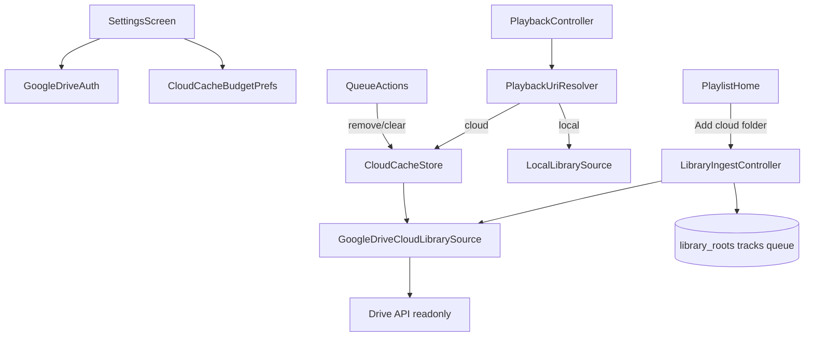

# Phase 7 — Google Drive read-only cloud (KISS)

Phase 6 (iOS) stays skipped. One provider only: **Google Drive** behind the existing [`CloudLibrarySource`](lib/core/cloud/cloud_library_source.dart) contract.

## Step 0 status — **completed**

(See earlier notes; device OAuth + list proven on A065.)

## Step 1 status — **completed**

**Done**

- Drift **schema v2**: `cloud_cache_entries` (`trackId` PK/FK, `remoteLocator`, `localPath`, `sizeBytes`, `lastAccessedAt`) + `onUpgrade`
- [`GoogleDriveCloudLibrarySource`](lib/core/cloud/google_drive_cloud_library_source.dart) via injectable [`DriveRemote`](lib/core/cloud/drive_remote.dart) / [`GoogleApiDriveRemote`](lib/core/cloud/google_api_drive_remote.dart)
- [`CloudCacheStore`](lib/core/cloud/cloud_cache_store.dart): upsert/touch/delete/clear + LRU `enforceBudget` (prefer non-queued; never protectTrackId)
- Free space: [`AndroidFreeSpaceSource`](lib/core/cloud/android/android_free_space_source.dart) + [`StoragePlugin`](android/app/src/main/kotlin/at/blumenlaube/tinytunes/StoragePlugin.kt) (`StatFs`); `UnlimitedFreeSpaceSource` for tests/non-Android
- Providers: `driveRemote`, `freeSpaceSource`, `cloudCacheDirectory`, `cloudLibrarySource`, `cloudCacheStore`
- Constants: [`SourceKinds`](lib/core/cloud/source_kinds.dart), [`CloudCacheBudget`](lib/core/cloud/cloud_cache_budget.dart)
- Tests: Drive source list/download/miss/space; cache LRU/protect/downloadAndIndex/delete; schema v2 row — all green

**Findings**

- Inject `DriveRemote` (not raw DriveApi) so unit tests need no HTTP/OAuth.
- `CloudLibraryEntry` now carries optional `sizeBytes` / `modifiedAt` for catalog fills.
- `downloadToCache` returns absolute path as `MediaLocator.value`; `resolveCached` → `file:` URI or `CloudCacheMissException`.
- Cloud ingest should **not** download for tags (lazy): list name/size only; tags stay null until a later polish if wanted.
- Schema bump landed in Step 1 (plan Step 2 text also mentioned it — already done).

## Step 2 status — **completed**

**Done**

- `LibraryIngestController.addCloudFolder` + `_walkCloudAndUpsert` (list-only, no tag download; optional recurse)
- Cloud branch on `rescanRoot` / `forgetRoot` (cache wipe + DB; no SAF release); `checkRevokedRoots` skips cloud
- Home app-bar cloud icon → Drive folder browser → “Also load subfolders?” dialog
- ARB en/de; unit tests in `test/features/library/cloud_ingest_test.dart`
- **Device gate (A065):** Add cloud folder (flat + recursive), Re-scan, Forget — **Pass**

**Findings**

- Cloud ingest intentionally skips `audiotags` (list name/size only); tags fill once on the play download / cache-hit path.
- Re-scan of cloud roots always recurses (`includeSubfolders: true`); Add respects the dialog choice.
- Selecting My Drive root itself is disabled in the browser (must pick a child folder) — avoids indexing the entire Drive by accident.

## Step 3 status — **completed** (device Pass 2026-08-06; follow-ups applied)

**Done**

- [`PlaybackUriResolver`](lib/features/player/application/playback_uri_resolver.dart): local SAF vs cloud cache hit / download-then-play + LRU budget (default 2 GB until Step 4 prefs)
- `QueueTrackView.sourceKind` from joined tracks; `queuedTrackIds` / `trackIdForQueueEntry` DAO helpers
- [`PlaybackController._loadAndPlay`](lib/features/player/application/playback_controller.dart) uses resolver; `PlaybackUiState.downloading` + `downloadProgress` + home strip with `LinearProgressIndicator`
- [`QueueActions`](lib/features/playlist/application/playlist_providers.dart) remove/clear deletes matching cloud cache files
- Listing order parity: SAF `DISPLAY_NAME ASC` + Drive `orderBy: name` + shared [`compareDisplayNames`](lib/features/library/application/library_entry_order.dart)
- Tests: resolver, queue cache, list/queue name order; playback controller / pump_app override `cloudLibrarySource`

**Findings**

- Budget still hardcoded to `CloudCacheBudget.defaultBytes` until Step 4 prefs slider.
- Download failures share the existing file-missing → unplayable auto-advance path.
- Drive API default list order is arbitrary; local providers often look sorted — now both use display-name ascending.

**Device gate (A065):** download / play / cache hit / remove→redownload — **Pass**. Follow-up: progress bar + name sort (hot reload / rebuild to verify).

## Step 4 status — **completed**

**Done**

- Settings: Sign in / Sign out (email when signed in); sign-out wipes all cloud cache
- Cloud cache budget prefs + slider (512 MB–32 GB, step 512 MB, default 2 GB); eviction on lower
- Clear cloud cache (confirm) via session controller
- Playback uses `cloudCacheBudgetControllerProvider` instead of hardcoded default
- Removed Settings “List My Drive” spike UI
- Tests: budget prefs/controller, session (memory DB), Settings widget smoke

**Findings**

- Avoid indeterminate `LinearProgressIndicator` in Settings during tests (`pumpAndSettle` never ends).
- Prefer sync filesystem cleanup in `CloudCacheStore` (`existsSync` / `deleteSync` / `listSync`) — async `Directory.list()` hung under the Windows test binder.

## Step 5 status — **completed** (device Pass 2026-08-06)

**Done**

- Feature doc [`docs/features/cloud-library.md`](docs/features/cloud-library.md) + index
- CHANGELOG `0.7.0` + pubspec **`0.7.0+7`**
- Roadmap: Phase 7 implemented; Phase 6 still skipped
- Cross-links in library-ingest / player docs
- **Device gate (A065):** Full smoke checklist — **Pass**

---

## Locked product decisions

| Topic | Decision |
| --- | --- |
| Provider | Google Drive; scope `https://www.googleapis.com/auth/drive.readonly` |
| Platforms | **Android only** |
| OAuth | Android client (package `at.blumenlaube.tinytunes` + debug SHA-1) + Web client as `serverClientId` |
| Web Client ID | `603107338638-gc0kmt8iq6enerqd9qtipcqvencsgq15.apps.googleusercontent.com` (public ID in app config; **never** commit `client_secret` / JSON) |
| Add flow | Sign-in → **Add cloud folder** → Drive folder browser → dialog **Also load subfolders?** → index into catalog/queue (same Add semantics as local) |
| Download | **Lazy** + **download-then-play** (progress UI; play from complete local file). Progressive stream deferred |
| Capacity | Per download: Drive `size` + device free space; fail that track with message/toast if insufficient |
| Cache delete | Remove queue row / Clear queue → delete that track’s cache file(s). Forget cloud root / Sign-out / Clear cloud cache → wipe relevant cache |
| LRU | After each successful download, if total cloud cache &gt; budget → silently delete oldest by `lastAccessedAt` (never now-playing; prefer not-in-queue first) |
| Budget UI | Settings slider: **512 MB … 32 GB**, step **512 MB**, default **2 GB**; persist in `shared_preferences`; on lower limit, run eviction once |
| Auth UI | Settings: Sign in with Google / Sign out (+ account email when signed in) |
| Playback miss | Missing cache / download fail / auth fail → same unplayable path as local (toast + message + auto-advance) |
| Remote writes | Never delete/rename/overwrite Drive content |
| Artwork | Still out of scope |

## Architecture (reuse seams)

**Identity**

- Cloud root / item `MediaLocator.value` = opaque Drive id string with prefix, e.g. `gdrive:<fileId>` (never a path).
- `sourceKind = cloud` on roots and tracks (column already exists).
- `sourceItemId` = same locator string (matches local Phase 2 pattern).
- Fill `sizeBytes` / `modifiedAt` from Drive listing when available (helps free-space checks).

**New Drift table (schema v2)** — `cloud_cache_entries`

- `trackId` PK/FK → `tracks.id` ON DELETE CASCADE  
- `localPath`, `sizeBytes`, `lastAccessedAt`  
- Migration: `schemaVersion => 2`; `onUpgrade` create table only (no rewrite of existing rows).

**Packages (pin in phase):** `google_sign_in` 7.2, `googleapis` 16 (Drive v3), `http` + thin Bearer client (not `extension_google_sign_in_as_googleapis_auth` unless needed), `path_provider` (already), device free-space — pick the smallest reliable Android approach during Step 1 (prefer no heavy plugin).

**Config:** [`lib/core/cloud/google_oauth_config.dart`](lib/core/cloud/google_oauth_config.dart) holds **only** the Web `serverClientId` string. Android client stays Console-only.

---

## Step 0 — OAuth spike + ADR (device gate)

- Wire `google_sign_in.initialize(serverClientId: …)` + request `drive.readonly`.
- Prove on physical Android: sign-in, list children of My Drive, sign-out.
- Write [`docs/adr/0002-google-drive-cloud-library.md`](docs/adr/0002-google-drive-cloud-library.md): read-only Drive, locator prefix, Android-only, no Firebase, no remote mutate.
- Update [`CONTEXT.md`](CONTEXT.md) Key ADRs link.

**Exit:** Signed-in listing works on device; ADR merged into the phase branch.

---

## Step 1 — `GoogleDriveCloudLibrarySource` + cache store

Replace [`UnimplementedCloudLibrarySource`](lib/core/cloud/cloud_library_source.dart) usage with a real impl:

| Method | Behavior |
| --- | --- |
| `list(parent)` | Drive `files.list` one level; folders + audio extensions (reuse [`audio_extensions.dart`](lib/features/library/application/audio_extensions.dart)) |
| `downloadToCache(item)` | `files.get(alt=media)` → app cache dir `cloud/<trackOrFileId>/…`; enforce free space; return cache locator |
| `resolveCached(item)` | File URI if present; else throw / typed miss |

Add `CloudCacheStore` (filesystem + Drift `cloud_cache_entries`): upsert on download, touch `lastAccessedAt` on resolve/play, delete by trackId / rootId / all, enforce budget LRU.

Riverpod: `cloudLibrarySourceProvider`, `cloudCacheStoreProvider`, `googleDriveAuthProvider` (signed-in account stream + signIn/signOut).

**Tests:** Fake Drive + temp dir — list/download/resolve; LRU evicts oldest; never “evict” mocked now-playing id.

---

## Step 2 — Schema v2 + ingest: Add cloud folder

- Bump Drift schema; DAO helpers for cloud cache + `upsertRoot(..., sourceKind: 'cloud')`.
- Extend [`LibraryIngestController`](lib/features/library/application/library_ingest_controller.dart) (keep **one** single-flight gate):
  - `addCloudFolder`: require signed-in → folder browser → subfolders yes/no → walk via `CloudLibrarySource.list` (recurse only if yes) → same batch upsert / append-queue / prune-after-complete rules as local.
  - `rescanRoot` / `forgetRoot`: branch on `sourceKind` — cloud uses Drive list / wipe cache + DB cascade (no SAF `releaseRoot`).
- Local `checkRevokedRoots` skips `cloud` roots (auth expiry is a play/download error, not a SAF strip).

**UI:** Home overflow or split action: **Add folder** (local) + **Add cloud folder** (disabled/prompt sign-in if needed). Empty-queue CTA stays local Add; optional secondary text link to cloud later — KISS: keep empty CTA local-only; cloud via app bar.

Simple modal **Drive folder browser** (list + navigate + Select). Then **Also load subfolders?** yes/no dialog.

**Exit:** Cloud root appears in catalog/queue; Re-scan / Forget work; no Drive writes.

---

## Step 3 — Playback URI resolver (download-then-play)

Today [`PlaybackController._loadAndPlay`](lib/features/player/application/playback_controller.dart) always calls `localLibrarySourceProvider.resolvePlaybackUri`.

Introduce a thin `PlaybackUriResolver`:

1. Load track `sourceKind` (+ id) for the queue row.  
2. `local` → existing SAF resolve.  
3. `cloud` → if cached, touch + return file URI; else show **Downloading…** (reuse home progress strip or transport busy state — one place only) → `downloadToCache` → enforce LRU → play file.  
4. Failures → existing `AdvanceReason.unplayable` path.

Wire [`QueueActions`](lib/features/playlist/application/playlist_providers.dart) remove/clear to delete corresponding cloud cache files after DB delete (lookup trackIds before delete).

**Exit:** Tap cloud track → download progress → play offline from cache; second tap is instant; remove from queue deletes file.

---

## Step 4 — Settings: account + cache budget + clear

Extend [`settings_screen.dart`](lib/features/settings/presentation/settings_screen.dart):

- **Google Drive:** Sign in / Sign out; show email when signed in. Sign-out: clear Google session + **wipe all cloud cache** (catalog roots remain until Forget).
- **Cloud cache limit:** slider 512 MB–32 GB, step 512 MB, label `Cloud cache limit: X.X GB`; save prefs; trigger eviction if over.
- **Clear cloud cache:** confirmation → delete all cache files + Drift cache rows (catalog/queue untouched).

en + de ARB for all new strings.

**Tests:** prefs round-trip for budget; clear cache empties store; widget smoke for sign-in button enabled state with auth fake.

---

## Step 5 — Docs, version, device smoke, roadmap

- Feature doc [`docs/features/cloud-library.md`](docs/features/cloud-library.md) + index + [`docs/CHANGELOG.md`](docs/CHANGELOG.md).
- Update library-ingest / player docs with cloud cross-links and smoke checklist.
- Bump [`pubspec.yaml`](pubspec.yaml) to **`0.7.0+7`**.
- Mark roadmap Phase 7 completed / Phase 6 still pending-skipped note.
- **Manual Android smoke:** sign-in → add folder (flat + recursive) → play (download then offline) → queue remove frees space → slider down evicts → Clear cache → Forget → sign-out; confirm Drive unchanged remotely.

---

## Out of scope (explicit)

- iOS, other cloud providers, progressive play-while-download  
- Firebase / `google-services.json`  
- Named playlists, drawer/nav changes  
- Shared-drive-specific UX beyond whatever default Drive API returns for the signed-in user  
- Artwork cache  

## Suggested implementation order

Step 0 (auth proof) → Step 1 (source + cache) → Step 2 (ingest UI) → Step 3 (play) → Step 4 (settings) → Step 5 (docs/smoke). Each step leaves the app analyzable/testable; device gates on 0 and 5.