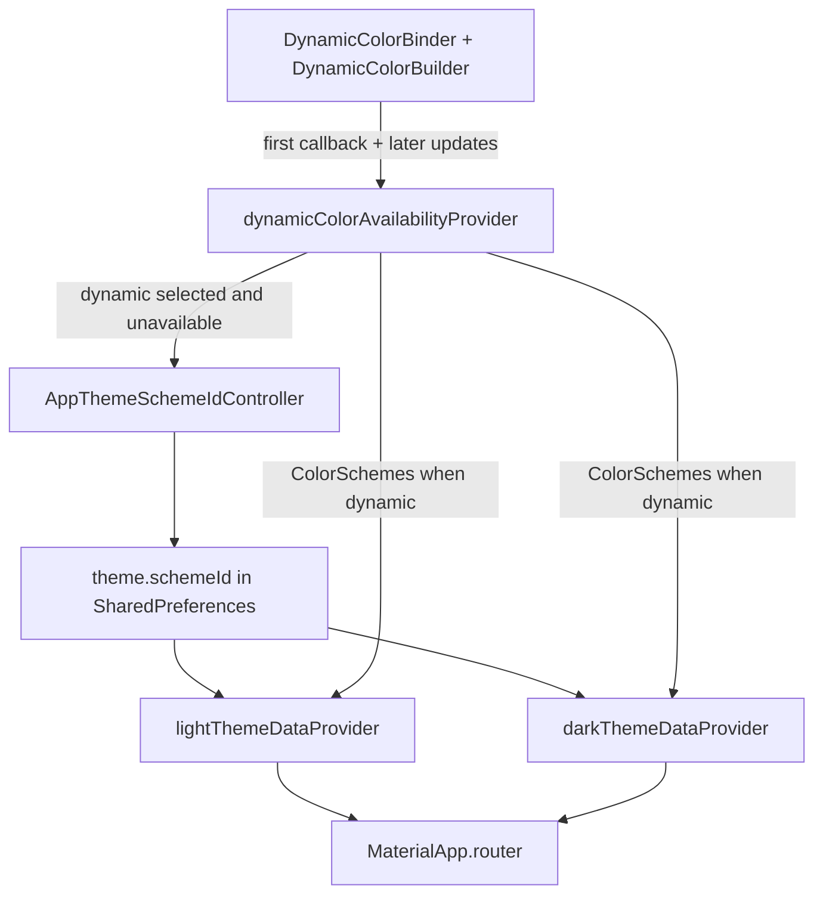

# Theme schemes + Appearance UI

## Locked product decisions

| Topic | Decision |
| --- | --- |
| Catalog ids | `default`, `highContrast`, `dynamic` |
| Fresh install | `default` (`theme.schemeId` missing → default) |
| `default` | seed `#88AA00`, `contrastLevel: 0.0`, `DynamicSchemeVariant.tonalSpot` |
| `highContrast` | same seed `#88AA00`, `contrastLevel: 1.0` (Material “high”), `tonalSpot` — aggressive; tone down after device smoke if needed |
| `dynamic` | Platform Material You schemes; no seed |
| Dynamic unavailable | Hide Dynamic chip |
| Prefs `dynamic` + unavailable | Rewrite to `default`, no toast/message |
| Wallpaper changes | Live (via `DynamicColorBuilder` rebuilds) |
| Mode UI | Flutter M3 `SegmentedButton` only — **no** extra UI package |
| Scheme UI | Option X: per-chip swatches + label; no name legend above the row |
| Sections | **Mode** + **Color scheme** (drop single “Appearance” header in Settings) |
| Dynamic help | Info icon on Color scheme header, **only when Dynamic chip is visible** → short dialog |
| Labels | Default / High contrast / Dynamic (EN + DE) |

Mode and scheme stay independent: Dynamic still uses `theme` / `darkTheme` / `themeMode` from Mode.

## Architecture (concrete)



### Why a binder widget (not only a provider)

`dynamic_color`’s live API is `DynamicColorBuilder` (widget). Riverpod owns `MaterialApp` themes today in [`lib/main.dart`](lib/main.dart). Bridge:

1. New [`lib/core/theme/dynamic_color_binder.dart`](lib/core/theme/dynamic_color_binder.dart): `ConsumerWidget` wrapping child with `DynamicColorBuilder`.
2. On each builder invocation, **post-frame** update a keepAlive notifier (never write Riverpod during `build`):

```dart
// Pseudocode — exact types in theme_providers.dart
void apply(ColorScheme? light, ColorScheme? dark) {
  state = DynamicColorAvailability(
    resolved: true,
    light: light,
    dark: dark,
  );
}
```

3. Wrap at root inside `TinyTunesApp` (still under `UncontrolledProviderScope`):

`DynamicColorBinder(child: ToastificationWrapper(... MaterialApp.router ...))`

### Availability + rewrite race (must not flap)

`DynamicColorBuilder` often emits `null, null` once before real schemes. **Do not rewrite prefs on that first null.**

| Phase | `resolved` | `light`/`dark` | Prefs | Effective themes if schemeId==dynamic |
| --- | --- | --- | --- | --- |
| Before first callback | `false` | — | unchanged | Temporarily show **default** themes; **do not** write prefs |
| After callback, colors present | `true` | non-null | unchanged | Use platform `ColorScheme`s |
| After callback, both null | `true` | null | if id==`dynamic` → write `default` | `default` themes |

Availability for picker: `resolved && light != null && dark != null`.

Rewrite: in a keepAlive provider that watches availability + scheme id (or inside `AppThemeSchemeIdController` / a small `dynamicSchemeGuardProvider` with `ref.listen`), call `setSchemeId(ThemeCatalog.defaultSchemeId)` only on the unavailable row above. No toast.

### Catalog / scheme model

Refactor [`lib/core/theme/app_theme_scheme.dart`](lib/core/theme/app_theme_scheme.dart) so static entries carry contrast:

- Fields: `id`, `seedColor`, `contrastLevel` (default `0.0`).
- `lightTheme` / `darkTheme` build via:

```dart
ColorScheme.fromSeed(
  seedColor: seedColor,
  brightness: ...,
  contrastLevel: contrastLevel,
  // dynamicSchemeVariant: tonalSpot (omit; API default)
)
```

[`lib/core/theme/theme_catalog.dart`](lib/core/theme/theme_catalog.dart):

- Constants: `defaultSchemeId = 'default'`, `highContrastSchemeId = 'highContrast'`, `dynamicSchemeId = 'dynamic'`.
- `ThemeCatalog.v1()` → rename usage to shipped catalog factory (e.g. `ThemeCatalog.standard()`) containing **two static** `AppThemeScheme`s: `default` (contrast `0.0`) and `highContrast` (contrast `1.0`), both seed `Color(0xFF88AA00)`.
- `resolve(String? id)` for **static** ids only; unknown → `default`. Dynamic is **not** stored as an `AppThemeScheme` seed entry.
- Helper: `List<String> pickerSchemeIds({required bool dynamicAvailable})` → `[default, highContrast]` + optional `dynamic`.

[`lib/core/theme/theme_providers.dart`](lib/core/theme/theme_providers.dart):

- Add `DynamicColorAvailability` + `dynamicColorAvailabilityProvider` (keepAlive notifier).
- Change `lightThemeData` / `darkThemeData`:

```text
if schemeId == dynamic:
  if availability.resolved && light/dark non-null → ThemeData(useMaterial3: true, colorScheme: that)
  else → catalog.default light/dark  // loading or falling through
else:
  catalog.resolve(schemeId).light/dark
```

- Keep `activeThemeSchemeProvider` for static schemes only, **or** replace call sites so Settings previews don’t assume Dynamic is an `AppThemeScheme`. Prefer: preview helper `ColorScheme previewSchemeFor(id, brightness, availability)` used by chips.

Prefs keys unchanged: `theme.mode`, `theme.schemeId` in [`theme_preferences.dart`](lib/core/theme/theme_preferences.dart).

### Dependency

- Add `dynamic_color` to [`pubspec.yaml`](pubspec.yaml) (current stable on pub.dev; no other theme-picker packages).

## Settings UI (concrete layout)

File: [`lib/features/settings/presentation/settings_screen.dart`](lib/features/settings/presentation/settings_screen.dart)

Replace the current Appearance `ListTile` + `RadioGroup` block with:

```text
Padding/ListTile title: l10n.settingsModeSection          // "Mode"
Padding(horizontal: 16): ThemeModeSegmentedControl

Padding: Row(
  Text(l10n.settingsColorSchemeSection),                 // "Color scheme"
  if (dynamicAvailable) IconButton(Icons.info_outline) → dialog
)
Padding(horizontal: 16, vertical: 8): ColorSchemePicker  // Row of chips
Divider
… Drive / About unchanged …
```

### New widgets (keep Settings readable)

| File | Role |
| --- | --- |
| `lib/features/settings/presentation/widgets/theme_mode_segmented_control.dart` | `SegmentedButton<AppThemeMode>`: System / Light / Dark; multiSelectionEnabled false; empty selection disallowed |
| `lib/features/settings/presentation/widgets/color_scheme_picker.dart` | Horizontal `Row` of `Expanded` chips from `pickerSchemeIds` |
| (private in picker or sibling) `scheme_preview_chip.dart` | One chip |

### Scheme chip anatomy (Option X)

- Tappable `Material` + `InkWell` (or `FilterChip`-like custom), height ~80–88.
- Top: row of **3** circles (diameter 14–16), colors from preview `ColorScheme`: **primary**, **secondary**, **surface** (fixed roles so chips are comparable).
- Bottom: label `bodySmall`, maxLines 1, ellipsis — `settingsSchemeDefault` / `HighContrast` / `Dynamic`.
- Selected: `Border.all` width 2 using `Theme.of(context).colorScheme.primary` (or outline + check icon top-trailing). **Do not** rely on fill color alone.
- Preview brightness: follow **effective** brightness — if Mode is System, use `MediaQuery.platformBrightnessOf(context)`; else Light→light scheme, Dark→dark scheme. Dynamic chip uses `availability.light/dark` for that brightness.
- No legend row of names above the chips.
- Semantics: `Semantics(button: true, selected: …, label: schemeName)`.

### Dynamic info dialog

- Title: `settingsSchemeDynamicInfoTitle` — e.g. “Dynamic”
- Body: `settingsSchemeDynamicInfoBody` — e.g. “Uses colors from your wallpaper (Material You). Light and dark still follow Mode.”
- DE equivalents in `app_de.arb`.
- Actions: single OK / Close using existing cancel/close pattern if any, else `TextButton` with Material OK.

## i18n

Edit [`lib/l10n/app_en.arb`](lib/l10n/app_en.arb) + [`lib/l10n/app_de.arb`](lib/l10n/app_de.arb):

| Key | EN (intent) | DE (intent) |
| --- | --- | --- |
| `settingsModeSection` | Mode | Modus |
| `settingsColorSchemeSection` | Color scheme | Farbschema |
| `settingsSchemeDefault` | Default | Standard |
| `settingsSchemeHighContrast` | High contrast | Hoher Kontrast |
| `settingsSchemeDynamic` | Dynamic | Dynamisch |
| `settingsSchemeDynamicInfoTitle` | Dynamic | Dynamisch |
| `settingsSchemeDynamicInfoBody` | (wallpaper + Mode sentence above) | German equivalent |

- Keep `settingsThemeSystem` / `Light` / `Dark`.
- Stop using `settingsAppearanceSection` in UI; **remove** from ARBs if unused after change (avoid dead strings).
- Run flutter gen-l10n as usual for this repo.

## Docs / changelog

- Rewrite scheme section in [`docs/features/theming.md`](docs/features/theming.md): three ids, contrastLevel, Dynamic binder + rewrite rule, Settings UI description, `Last updated: 2026-08-07`.
- [`docs/features/README.md`](docs/features/README.md): one-line theming blurb if it still says “v1 only default”.
- [`docs/CHANGELOG.md`](docs/CHANGELOG.md) under Unreleased **Added**: scheme picker (Default / High contrast / Dynamic), Material You live colors, aggressive high-contrast scheme, Mode segmented control + scheme swatch chips, Dynamic info dialog.

## Tests (concrete cases)

### `test/core/theme/theme_resolution_test.dart` (new)

- `ThemeCatalog.resolve(null|unknown)` → `default`.
- `highContrast` light/dark `ColorScheme` uses higher contrast than `default` for the same seed (assert e.g. different `onSurface`/`surface` or document contrastLevel wiring via constructing schemes the same way as production).
- Provider: schemeId `dynamic` + availability unresolved → themes equal default **and** prefs still `dynamic`.
- Provider: schemeId `dynamic` + resolved unavailable → prefs become `default` (pump microtasks / `await`).
- Provider: schemeId `dynamic` + resolved with fake light/dark → `lightThemeData.colorScheme.primary` matches fake.

Override `dynamicColorAvailabilityProvider` in tests — **do not** require real `DynamicColorBuilder` in unit tests.

### [`test/features/settings/settings_screen_test.dart`](test/features/settings/settings_screen_test.dart)

- Rename/replace “theme mode radios” test → tap Light on `SegmentedButton` / find `settingsThemeLight`, assert prefs + controller.
- With availability overridden **available**: find three scheme labels; tap High contrast; assert `theme.schemeId == highContrast`.
- With availability overridden **unavailable**: `settingsSchemeDynamic` findsNothing; info icon findsNothing.
- With Dynamic available: tap info → find dialog body text; dismiss.

Update [`test/helpers/pump_app.dart`](test/helpers/pump_app.dart) only if root needs binder defaults — prefer provider overrides so tests stay sync.

## File checklist

| Action | Path |
| --- | --- |
| Add dep | `pubspec.yaml` (`dynamic_color`) |
| Add | `lib/core/theme/dynamic_color_binder.dart` |
| Edit | `lib/core/theme/app_theme_scheme.dart` (`contrastLevel`) |
| Edit | `lib/core/theme/theme_catalog.dart` (ids + picker list) |
| Edit | `lib/core/theme/theme_providers.dart` (+ codegen) |
| Edit | `lib/main.dart` (`DynamicColorBinder` wrap) |
| Edit | `lib/features/settings/presentation/settings_screen.dart` |
| Add | `lib/features/settings/presentation/widgets/theme_mode_segmented_control.dart` |
| Add | `lib/features/settings/presentation/widgets/color_scheme_picker.dart` |
| Edit | `lib/l10n/app_en.arb`, `app_de.arb` (+ generated l10n) |
| Edit | `docs/features/theming.md`, `docs/features/README.md`, `docs/CHANGELOG.md` |
| Add | `test/core/theme/theme_resolution_test.dart` |
| Edit | `test/features/settings/settings_screen_test.dart` |

## Explicit non-goals

- Extra static schemes beyond `highContrast`
- Skins / alternate layouts
- Harmonize-with-brand on Dynamic (`colorScheme.harmonized()`) — **skip v1 of this feature** (pure platform schemes)
- Other Phase 8 store work
- Forcing Dynamic on iOS (hide when plugin returns null)

## Device smoke (Android)

1. Mode × Default / High contrast / Dynamic — confirm high contrast is visibly harsh and accents pop.
2. Dynamic selected → change wallpaper → app colors update without kill.
3. Emulator/API without wallpaper colors (or forced null override build): Dynamic hidden; launching with prefs pre-set to `dynamic` rewrites to `default` after first binder callback.
4. TalkBack: scheme chips announce name + selected state.
