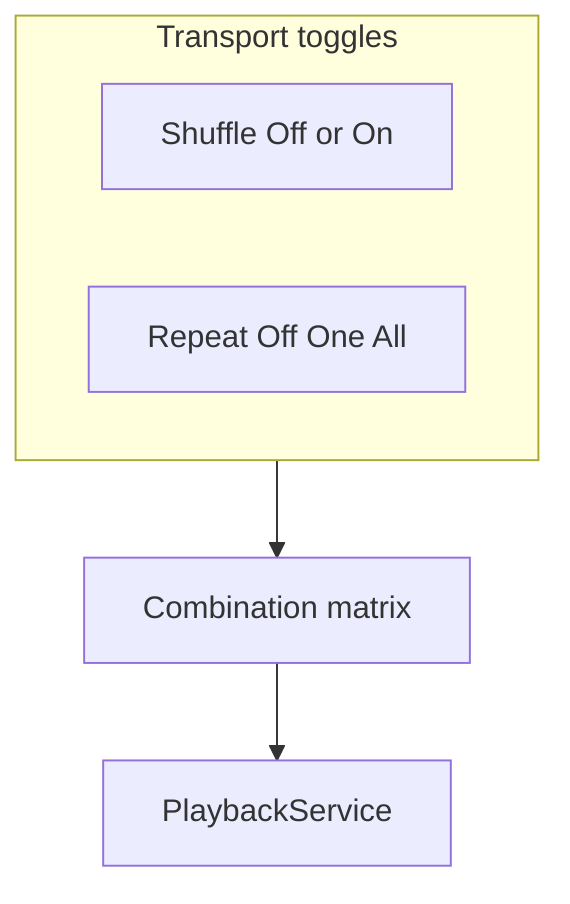
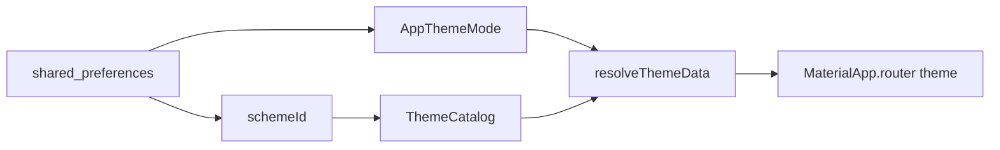
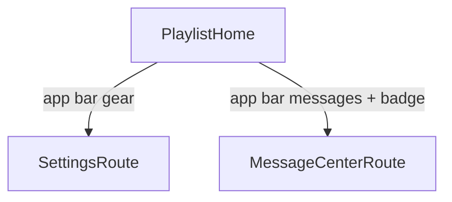

# TinyTunes high-level roadmap (hardened)

## Goals and constraints

- **First milestone:** Personal Android daily driver (local folders + background + shuffle), not store-ready.
- **Playlist model:** One Winamp-inspired **queue** — tap title to play; manage actions on the home screen; not named multi-playlists.
- **Catalog vs queue:** Separate Drift entities — indexed library roots/tracks vs ordered queue entries (locked).
- **Platforms:** Android first; iOS implements the same locator/source contracts later (not “path assumptions + late fixes”).
- **Cloud:** Minimal `CloudLibrarySource` **contract stub early**; one provider + implementation only in the cloud phase. Read-only forever (list/download/cache; never remote delete/write/rename).
- **Stack:** Follow `[.cursor/rules/00-allgemeine-projektregeln.mdc](.cursor/rules/00-allgemeine-projektregeln.mdc)`. `[pubspec.yaml](pubspec.yaml)` pins deps; `[lib/main.dart](lib/main.dart)` is still a minimal shell — routing, Drift, features, audio, and file access are unimplemented.
- **Navigation:** No drawer / bottom nav — playlist home + app-bar Settings and Messages (see IA).

---

## Locked product decisions

| Topic                        | Decision                                                                                                                                                                 |
| ---------------------------- | ------------------------------------------------------------------------------------------------------------------------------------------------------------------------ |
| Adding a folder              | Scan into **catalog** and **append all discovered tracks to the queue**                                                                                                  |
| Clear playlist               | Empties the **queue only** — catalog/roots untouched                                                                                                                     |
| Remove track                 | Removes **queue entry only** — catalog row stays                                                                                                                         |
| Forget folder                | Explicit action: drop root + its catalog tracks + related queue entries                                                                                                  |
| Cold-start resume            | Restore track + position; start **paused**                                                                                                                               |
| Messages                     | Bounded **in-memory session** store (no Drift persistence for v1)                                                                                                        |
| Playback phases              | **One slice:** foreground + `just_audio_background` together                                                                                                             |
| Shuffle / Repeat             | Two transport controls — see **Playback modes** below (full matrix in Phase 4)                                                                                           |
| SAF failure                  | If `file_picker` cannot retain durable tree access → **small native SAF adapter**                                                                                        |
| Re-scan missing files        | After a **complete successful** re-scan: **hard-delete** missing catalog tracks and prune related queue entries. Partial/failed/cancelled scans must **not** mass-delete |
| Theme mode (v1)              | **System / Light / Dark** in Settings                                                                                                                                    |
| Theme schemes                | **Catalog** of named schemes; each scheme supplies light + dark `ThemeData`. v1 ships only `default`                                                                     |
| Brand seed                   | `#88aa00` for the `default` scheme                                                                                                                                       |
| Dynamic color (Material You) | **Not** in daily driver; add optional **Dynamic** scheme at **store readiness** (Phase 8)                                                                                |

**Why hard-delete (not “unavailable”):** Dead queue rows are worse UX for a Winamp-style list. The safety net is scan completeness: only prune after a full successful walk so a cancelled or permission-lost scan cannot wipe the library.

**Playback / settings persistence:** Queue + playback state live in **Drift**. `shared_preferences` is settings-only (theme mode/scheme id, locale flags).

---

## Playback modes (locked) — Shuffle × Repeat

Two independent transport controls (icons on playlist/transport chrome; **not** Settings):

| Control     | Values                  |
| ----------- | ----------------------- |
| **Shuffle** | Off / On                |
| **Repeat**  | Off → One → All (cycle) |

No greying out — every combination has defined behavior.

| Shuffle | Repeat | Behavior                                                                                                         |
| ------- | ------ | ---------------------------------------------------------------------------------------------------------------- |
| Off     | Off    | Canonical queue order; **stop** at end                                                                           |
| Off     | All    | Canonical order; **loop** whole queue                                                                            |
| Off     | One    | Loop **current** track                                                                                           |
| On      | Off    | Random **permutation**; each track **exactly once**; **stop** at end                                             |
| On      | All    | **With-replacement** random next; continues **indefinitely**                                                     |
| On      | One    | Loop **current** track; on **Next**, advance (random pick if Shuffle on, else next in order) and loop that track |

**Other locked rules:**

- Turning **Shuffle off** restores **canonical** queue order; keep current track if still in the queue.
- **Previous:** walk permutation / history stack (Shuffle+All uses play history — not a new random jump).
- Queue edits: append new imports at end of canonical order (and of permutation when Shuffle+Off); Shuffle+All uses the updated set for the next pick.
- Persist `shuffleEnabled` + `repeatMode` (+ permutation/seed/history as needed) in Drift `playback_state`; restore on cold start.

---

## Theming architecture (locked — extensible without rewrite)

Two independent knobs:

| Knob       | Controls                                                             | Persistence          | v1 UI                                                                   |
| ---------- | -------------------------------------------------------------------- | -------------------- | ----------------------------------------------------------------------- |
| **Mode**   | System / Light / Dark                                                | `shared_preferences` | Settings control (wired when Settings is filled; plumbing earlier)      |
| **Scheme** | Named palette family (`default`, later `highContrast`, `dynamic`, …) | `shared_preferences` | Hidden or single-scheme until more exist; Dynamic only at store release |

**Code shape (Phase 1):**

- `AppThemeMode` enum + prefs read/write (Riverpod).
- `ThemeCatalog` / `AppThemeScheme` — maps `schemeId` → factory that builds light and dark `ThemeData` from a seed (Material 3 `ColorScheme.fromSeed`).
- v1: one entry `default` with seed `**Color(0xFF88AA00)**`.
- `MaterialApp.router` uses `theme` / `darkTheme` / `themeMode` from the resolver — **never** hard-code colors in feature widgets; use `Theme.of(context)` / color scheme tokens.
- Later schemes = new catalog entries (no feature rewrite). Full Winamp-style **skins** (alternate layouts) stay out of scope; this architecture does not block adding a separate skin layer later if ever needed.

**Phase mapping:** plumbing + default scheme in **Phase 1**; Settings mode picker in **Phase 5** (Settings fill); optional Dynamic scheme in **Phase 8**.

---

## Information architecture (locked)

| Element                  | Choice                                                      |
| ------------------------ | ----------------------------------------------------------- |
| Primary screen           | Queue list + transport chrome (home)                        |
| Side drawer / bottom nav | No                                                          |
| Settings                 | App-bar gear → `/settings`                                  |
| Message center           | App-bar icon + unread badge → `/messages`                   |
| Playlist actions         | On home (add folder, clear, remove, shuffle, forget folder) |

---

## Message center + toasts (locked)

| Channel          | Role                                                         |
| ---------------- | ------------------------------------------------------------ |
| `toastification` | Short ephemeral feedback                                     |
| Message center   | Session log: severity + stable **ref** + message + timestamp |

- **API frozen in Phase 1:** e.g. `reportError` / `reportInfo` (controllers map failures once → message + toast). No `BuildContext` / toast calls inside repositories.
- **Unread:** created since Messages was last opened; mark read on open.
- **Bound:** max entries + eviction (oldest first) so large scans cannot grow forever.
- **Storage:** in-memory for daily driver; no cross-restart persistence unless revisited later.

---

## Cross-phase acceptance rules

- Every phase ends with codegen (when touched), analyze, tests, and an Android run; platform behavior needs a **physical-device** check where relevant.
- Public Flutter APIs get `///` intent docs immediately.
- Feature modules update `docs/features/`, `docs/features/README.md`, and `docs/CHANGELOG.md` **in the same phase** they land (not batched into Phase 5).
- Localize user-visible strings in the phase that introduces them (ARB incremental).
- Failures reported once with a stable ref.
- No scan deletion after cancel, permission loss, or partial traversal.
- No remote write/delete/rename at the cloud boundary.

---

## Phase 0 — Feasibility and dependency gate

**Outcome:** Prove the stack and durable Android folder access before building product UI on sand.

- Prove `build_runner` generates Riverpod, Freezed, Drift, JSON, and typed routes in one clean run; analyze + tests. Prefer a disposable smoke fixture over an empty production DB. **Repin packages** if analyzer overrides cannot produce clean codegen.
- **Android device spike:** select folder → retain access after process death/reboot → recursive enumerate → read tags/artwork for one file → play that file.
- Choose storage approach from spike results: retainable SAF via `file_picker` if it actually works, else **narrow native SAF adapter** (locked fallback). Do not bake plain `File` paths into the domain model.
- Define contracts (no heavy UI): `MediaLocator`, `LocalLibrarySource`, `TrackMetadataReader`, and minimal read-only `CloudLibrarySource` stub. Local adapter resolves opaque items to a playback URI and, if needed, a temporary readable path/stream for tag extraction (bounded, deleted after use).

**Exit:** Clean codegen/analyze/test + documented Android device proof for durable access, metadata, and playback. Storage adapter direction chosen.

---

## Phase 1 — App shell and shared infrastructure

**Outcome:** Locked IA shell + frozen message/toast pipeline + theme plumbing + test harness.

- Feature-first folders: `lib/features/...`, `lib/shared/...`, `lib/core/...`.
- `MaterialApp.router` + typed `go_router_builder` routes: `/`, `/settings`, `/messages`.
- Playlist home shell: app bar messages + settings; placeholder body/transport.
- Material 3 + **theme architecture**: `AppThemeMode`, `ThemeCatalog` with `default` scheme seed `#88aa00`, prefs-backed providers; `theme` / `darkTheme` / `themeMode` wired. Settings screen can show a stub until Phase 5 mode UI.
- Localization-aware shell.
- Bounded in-memory message store + toast helper; badge/read behavior; demo report path.
- `test/helpers/pump_app.dart` with `ProviderScope` + router overrides; fix scaffold widget test.
- Bootstrap `docs/features/README.md` and `docs/CHANGELOG.md`.
- Keep `CloudLibrarySource` as contract-only (no provider).

**Exit:** Navigate Settings/Messages on Android; toast + message + badge work; light/dark/system resolve correctly with green seed; tests use the harness.

---

## Phase 2 — Local catalog and single queue

**Outcome:** Folders become a durable catalog and a Winamp queue that survives restart.

### Schema v1 (Drift)

- `library_roots` — opaque root locator, display name, platform metadata
- `tracks` — `(rootId, sourceItemId)` unique; source locator; relative/display path; size/modified; tag fields; artwork cache ref
- `queue_entries` — ordered links to `tracks` (order lives here, not on tracks)
- `playback_state` — singleton: current queue entry/track, positionMs, `shuffleEnabled`, `repeatMode`, permutation/seed/history as needed (filled by Phase 3–4)

Optional early: `track.source` / locator kind enum so cloud cache entries do not force a later migration.

### Semantics

- First import / add folder: upsert catalog, **append** new tracks to queue.
- Re-scan: upsert by identity; after **complete successful** scan, **hard-delete** missing tracks and prune queue; partial failure → no mass-delete; report counts via message center.
- Remove queue row ≠ delete catalog. Clear queue ≠ forget roots. **Forget folder** removes root + catalog + related queue rows.
- SAF-first: no broad storage permission unless a concrete API requires it.
- Scan off UI thread (isolate/chunked) with bounded metadata concurrency and batched writes; progress messages (“Scanning… n/m”).
- Manual re-scan (not every cold start) unless later product change.
- Feature docs for library ingest in this phase.

**Exit:** Nested folder survives restart/reboot; idempotent rescan does not duplicate; revoked access reported; queue order persists.

---

## Phase 3 — Playback + background (one vertical slice)

**Outcome:** Hear music in foreground and background without a later `main()` rewrite.

- `JustAudioBackground.init()` before `runApp`; configure `audio_session`; Android manifest service / notification / wake-lock as required.
- One application-lifetime non-`autoDispose` player via `PlaybackService` / controller; every source carries stable track id + `MediaItem` metadata from day one.
- UI: row tap to play, play/pause, prev/next, seek, current-row highlight; cover optional.
- Lock-screen / notification controls; headset noisy + interruption policy.
- Persist playback state in Drift on track change / seek / pause (throttled position); cold start restores **paused** if item still available.
- Missing current file: toast + message center + skip to next (basic); edge polish in Phase 5.
- Feature docs for player in this phase.

**Exit:** Foreground + background, controls, interruptions, and process recreation pass on a physical Android device.

---

## Phase 4 — Shuffle, Repeat, and queue management polish

**Outcome:** Full Shuffle × Repeat matrix on the single queue; reliable prev/next.

- Transport chrome: **Shuffle** toggle + **Repeat** cycle (Off / One / All) — see [Playback modes](#playback-modes-locked--shuffle--repeat).
- Implement matrix behaviors exactly (permutation + stop; with-replacement infinite; Repeat One + Next advances then loops).
- Keep **canonical** queue order separate from shuffle permutation / play history.
- Persist mode + order/history in `playback_state`; cold start restores both toggles.
- Destructive confirmations for clear / forget folder as needed. No drag-reorder unless daily use demands it.

**Exit:** All six Shuffle×Repeat combinations match the matrix; prev/next and queue edits behave as locked; modes survive process death.

---

## Phase 5 — Android daily-driver hardening

**Outcome:** Reliable personal use on a documented device/API matrix.

- Scan progress/cancellation UX; empty / revoked / missing-file states.
- Artwork-cache cleanup; message history bound already enforced — add clear-all / severity filter if useful.
- Settings filled for daily use: **theme mode** (System / Light / Dark), locale/about; queue actions stay on home. Scheme picker only if/when more than `default` exists (not required for daily driver).
- Expand tests: DAO/migrations, scanner with fakes, player controller with fake adapter, widget tests with overrides; large-library smoke on device.
- Update feature docs/changelog as behavior hardens (not first-time docs dump).

**Exit:** You would actually use it day-to-day on Android.

---

## Phase 6 — iOS storage and playback parity

**Outcome:** Same catalog/queue/player contracts on iOS — adapter work, not schema rewrite.

- Implement iOS `LocalLibrarySource` with **security-scoped access/bookmarks** (or explicitly document import-to-sandbox only if bookmarks prove impossible — prefer bookmarks).
- Background audio mode; metadata, interruptions, lock screen, relaunch, revoked folder access on a **real device**.
- Changing Drift domain semantics here means Phase 0–2 failed the locator gate.

**Exit:** Same contracts pass on iOS without redesigning persistence.

---

## Phase 7 — Read-only cloud sync

**Outcome:** One provider behind the existing `CloudLibrarySource` contract.

- List / download / cache only; playback uses validated local cache locators.
- Stable remote source IDs; eviction never mutates remote content.
- Provider SDK chosen in this phase only.

**Exit:** Cloud folder → cached tracks play offline; read-only scope verified.

---

## Phase 8 — Store readiness

**Outcome:** Public release quality after personal use is proven.

- Privacy, listings, icons, splash, accessibility, permission copy.
- Performance on large libraries; signing, versioning, changelog discipline.
- Migration tests before treating daily-driver data as durable release data.
- **Theming:** add optional **Dynamic** scheme (Material You / wallpaper-derived colors on supported Android); keep `default` (`#88aa00`) as the brand fallback. Expose scheme picker in Settings once more than one scheme ships.

---

## What we deliberately defer

- Named multi-playlists / smart playlists / drag-reorder (unless needed)
- Drawer / bottom navigation (revisit if destinations multiply after cloud)
- Extra color schemes beyond `default` until wanted; **Dynamic** until Phase 8
- Full visual **skins** (custom layouts) — separate from the scheme catalog
- Equalizer, lyrics, social, writing tags back to files
- Message persistence across restarts
- Cloud provider choice until Phase 7

## Suggested build rhythm

Vertical slices: prove access → shell → catalog/queue → play+background → shuffle/repeat → harden. Each phase leaves Android runnable; docs and i18n travel with the feature.