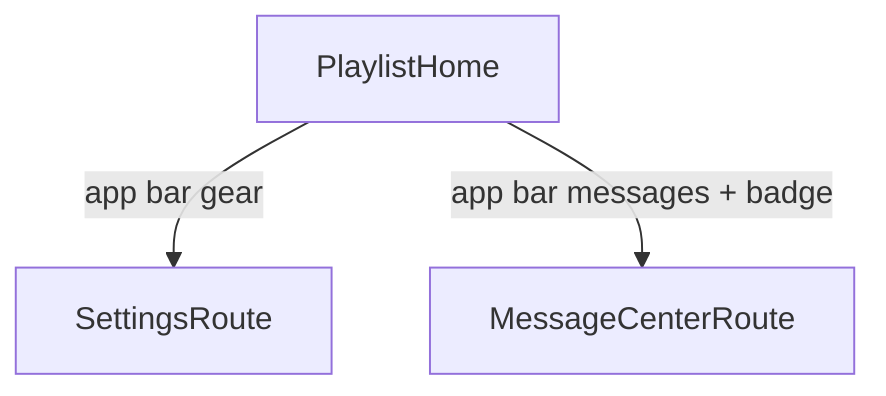

# TinyTunes high-level roadmap (hardened)

## Goals and constraints

- **First milestone:** Personal Android daily driver (local folders + background + shuffle), not store-ready.
- **Playlist model:** One Winamp-inspired **queue** — tap title to play; manage actions on the home screen; not named multi-playlists.
- **Catalog vs queue:** Separate Drift entities — indexed library roots/tracks vs ordered queue entries (locked).
- **Platforms:** Android first; iOS implements the same locator/source contracts later (not “path assumptions + late fixes”).
- **Cloud:** Minimal `CloudLibrarySource` **contract stub early**; one provider + implementation only in the cloud phase. Read-only forever (list/download/cache; never remote delete/write/rename).
- **Stack:** Follow [`.cursor/rules/00-allgemeine-projektregeln.mdc`](.cursor/rules/00-allgemeine-projektregeln.mdc). [`pubspec.yaml`](pubspec.yaml) pins deps; [`lib/main.dart`](lib/main.dart) is still a minimal shell — routing, Drift, features, audio, and file access are unimplemented.
- **Navigation:** No drawer / bottom nav — playlist home + app-bar Settings and Messages (see IA).

---

## Locked product decisions

| Topic | Decision |
|-------|----------|
| Adding a folder | Scan into **catalog** and **append all discovered tracks to the queue** |
| Clear playlist | Empties the **queue only** — catalog/roots untouched |
| Remove track | Removes **queue entry only** — catalog row stays |
| Forget folder | Explicit action: drop root + its catalog tracks + related queue entries |
| Cold-start resume | Restore track + position; start **paused** |
| Messages | Bounded **in-memory session** store (no Drift persistence for v1) |
| Playback phases | **One slice:** foreground + `just_audio_background` together |
| Shuffle | Persist permutation/seed; toggle off restores canonical order; new imports append at end |
| SAF failure | If `file_picker` cannot retain durable tree access → **small native SAF adapter** |
| Re-scan missing files | After a **complete successful** re-scan: **hard-delete** missing catalog tracks and prune related queue entries. Partial/failed/cancelled scans must **not** mass-delete |

**Why hard-delete (not “unavailable”):** Dead queue rows are worse UX for a Winamp-style list. The safety net is scan completeness: only prune after a full successful walk so a cancelled or permission-lost scan cannot wipe the library.

**Playback / settings persistence:** Queue + playback state live in **Drift**. `shared_preferences` is settings-only (theme/locale flags).

---

## Information architecture (locked)

| Element | Choice |
|---------|--------|
| Primary screen | Queue list + transport chrome (home) |
| Side drawer / bottom nav | No |
| Settings | App-bar gear → `/settings` |
| Message center | App-bar icon + unread badge → `/messages` |
| Playlist actions | On home (add folder, clear, remove, shuffle, forget folder) |

---

## Message center + toasts (locked)

| Channel | Role |
|---------|------|
| `toastification` | Short ephemeral feedback |
| Message center | Session log: severity + stable **ref** + message + timestamp |

- **API frozen in Phase 1:** e.g. `reportError` / `reportInfo` (controllers map failures once → message + toast). No `BuildContext` / toast calls inside repositories.
- **Unread:** created since Messages was last opened; mark read on open.
- **Bound:** max entries + eviction (oldest first) so large scans cannot grow forever.
- **Storage:** in-memory for daily driver; no cross-restart persistence unless revisited later.

---

## Cross-phase acceptance rules

- Every phase ends with codegen (when touched), analyze, tests, and an Android run; platform behavior needs a **physical-device** check where relevant.
- Public Flutter APIs get `///` intent docs immediately.
- Feature modules update `docs/features/`, `docs/features/README.md`, and `docs/CHANGELOG.md` **in the same phase** they land (not batched into Phase 5).
- Localize user-visible strings in the phase that introduces them (ARB incremental).
- Failures reported once with a stable ref.
- No scan deletion after cancel, permission loss, or partial traversal.
- No remote write/delete/rename at the cloud boundary.

---

## Phase 0 — Feasibility and dependency gate

**Outcome:** Prove the stack and durable Android folder access before building product UI on sand.

- Prove `build_runner` generates Riverpod, Freezed, Drift, JSON, and typed routes in one clean run; analyze + tests. Prefer a disposable smoke fixture over an empty production DB. **Repin packages** if analyzer overrides cannot produce clean codegen.
- **Android device spike:** select folder → retain access after process death/reboot → recursive enumerate → read tags/artwork for one file → play that file.
- Choose storage approach from spike results: retainable SAF via `file_picker` if it actually works, else **narrow native SAF adapter** (locked fallback). Do not bake plain `File` paths into the domain model.
- Define contracts (no heavy UI): `MediaLocator`, `LocalLibrarySource`, `TrackMetadataReader`, and minimal read-only `CloudLibrarySource` stub. Local adapter resolves opaque items to a playback URI and, if needed, a temporary readable path/stream for tag extraction (bounded, deleted after use).

**Exit:** Clean codegen/analyze/test + documented Android device proof for durable access, metadata, and playback. Storage adapter direction chosen.

---

## Phase 1 — App shell and shared infrastructure

**Outcome:** Locked IA shell + frozen message/toast pipeline + test harness.

- Feature-first folders: `lib/features/...`, `lib/shared/...`, `lib/core/...`.
- `MaterialApp.router` + typed `go_router_builder` routes: `/`, `/settings`, `/messages`.
- Playlist home shell: app bar messages + settings; placeholder body/transport.
- Material 3; localization-aware shell.
- Bounded in-memory message store + toast helper; badge/read behavior; demo report path.
- `test/helpers/pump_app.dart` with `ProviderScope` + router overrides; fix scaffold widget test.
- Bootstrap `docs/features/README.md` and `docs/CHANGELOG.md`.
- Keep `CloudLibrarySource` as contract-only (no provider).

**Exit:** Navigate Settings/Messages on Android; toast + message + badge work; tests use the harness.

---

## Phase 2 — Local catalog and single queue

**Outcome:** Folders become a durable catalog and a Winamp queue that survives restart.

### Schema v1 (Drift)

- `library_roots` — opaque root locator, display name, platform metadata
- `tracks` — `(rootId, sourceItemId)` unique; source locator; relative/display path; size/modified; tag fields; artwork cache ref
- `queue_entries` — ordered links to `tracks` (order lives here, not on tracks)
- `playback_state` — singleton: current queue entry/track, positionMs, shuffle flags/seed (filled by Phase 3–4)

Optional early: `track.source` / locator kind enum so cloud cache entries do not force a later migration.

### Semantics

- First import / add folder: upsert catalog, **append** new tracks to queue.
- Re-scan: upsert by identity; after **complete successful** scan, **hard-delete** missing tracks and prune queue; partial failure → no mass-delete; report counts via message center.
- Remove queue row ≠ delete catalog. Clear queue ≠ forget roots. **Forget folder** removes root + catalog + related queue rows.
- SAF-first: no broad storage permission unless a concrete API requires it.
- Scan off UI thread (isolate/chunked) with bounded metadata concurrency and batched writes; progress messages (“Scanning… n/m”).
- Manual re-scan (not every cold start) unless later product change.
- Feature docs for library ingest in this phase.

**Exit:** Nested folder survives restart/reboot; idempotent rescan does not duplicate; revoked access reported; queue order persists.

---

## Phase 3 — Playback + background (one vertical slice)

**Outcome:** Hear music in foreground and background without a later `main()` rewrite.

- `JustAudioBackground.init()` before `runApp`; configure `audio_session`; Android manifest service / notification / wake-lock as required.
- One application-lifetime non-`autoDispose` player via `PlaybackService` / controller; every source carries stable track id + `MediaItem` metadata from day one.
- UI: row tap to play, play/pause, prev/next, seek, current-row highlight; cover optional.
- Lock-screen / notification controls; headset noisy + interruption policy.
- Persist playback state in Drift on track change / seek / pause (throttled position); cold start restores **paused** if item still available.
- Missing current file: toast + message center + skip to next (basic); edge polish in Phase 5.
- Feature docs for player in this phase.

**Exit:** Foreground + background, controls, interruptions, and process recreation pass on a physical Android device.

---

## Phase 4 — Shuffle and queue management polish

**Outcome:** Deterministic random mode on the single queue.

- Keep **canonical** queue order separate from **shuffled** effective order; persist seed/permutation when needed for restore.
- Toggle on: current track stays stable; upcoming follows shuffle. Toggle off: restore canonical order.
- Newly appended imports (add folder mid-shuffle) append at end of both orders.
- Prev/next: walk shuffled order when on; maintain enough history for true previous (not re-roll).
- Destructive confirmations for clear / forget folder as needed. No drag-reorder unless daily use demands it.

**Exit:** Shuffle never loses/duplicates entries; toggle off restores canonical order; cold start restores shuffle state if enabled.

---

## Phase 5 — Android daily-driver hardening

**Outcome:** Reliable personal use on a documented device/API matrix.

- Scan progress/cancellation UX; empty / revoked / missing-file states.
- Artwork-cache cleanup; message history bound already enforced — add clear-all / severity filter if useful.
- Settings filled for daily use (locale/theme/about); queue actions stay on home.
- Expand tests: DAO/migrations, scanner with fakes, player controller with fake adapter, widget tests with overrides; large-library smoke on device.
- Update feature docs/changelog as behavior hardens (not first-time docs dump).

**Exit:** You would actually use it day-to-day on Android.

---

## Phase 6 — iOS storage and playback parity

**Outcome:** Same catalog/queue/player contracts on iOS — adapter work, not schema rewrite.

- Implement iOS `LocalLibrarySource` with **security-scoped access/bookmarks** (or explicitly document import-to-sandbox only if bookmarks prove impossible — prefer bookmarks).
- Background audio mode; metadata, interruptions, lock screen, relaunch, revoked folder access on a **real device**.
- Changing Drift domain semantics here means Phase 0–2 failed the locator gate.

**Exit:** Same contracts pass on iOS without redesigning persistence.

---

## Phase 7 — Read-only cloud sync

**Outcome:** One provider behind the existing `CloudLibrarySource` contract.

- List / download / cache only; playback uses validated local cache locators.
- Stable remote source IDs; eviction never mutates remote content.
- Provider SDK chosen in this phase only.

**Exit:** Cloud folder → cached tracks play offline; read-only scope verified.

---

## Phase 8 — Store readiness

**Outcome:** Public release quality after personal use is proven.

- Privacy, listings, icons, splash, accessibility, permission copy.
- Performance on large libraries; signing, versioning, changelog discipline.
- Migration tests before treating daily-driver data as durable release data.

---

## What we deliberately defer

- Named multi-playlists / smart playlists / drag-reorder (unless needed)
- Drawer / bottom navigation (revisit if destinations multiply after cloud)
- Equalizer, lyrics, social, writing tags back to files
- Message persistence across restarts
- Cloud provider choice until Phase 7

## Suggested build rhythm

Vertical slices: prove access → shell → catalog/queue → play+background → shuffle → harden. Each phase leaves Android runnable; docs and i18n travel with the feature.
